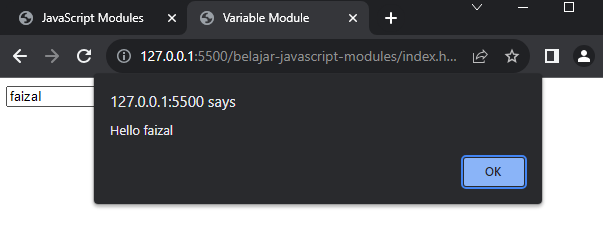

# Dynamic Module Loading

---

## Dynamic Module Loading

- Saat kita menggunakan module dengan cara import, maka semua module akan di load
- Pada kenyataannya, kadang kita tidak ingin meload semua module diawal, kita ingin meload module ketika dibutuhkan saja, ini akan menghemat bandwith jaringan juga, karena kita tidak perlu download semua module diawal
- JavaScript mendukung dynamic module loading, caranya kita bisa menggunakan function import(), dimana hasilnya berupa Promise<ModuleObject> (Promise adalah materi yang kompleks, ini akan dibahas di kelas JavaScript Async)

---

## Kode : Module

```js
export function alertHello(name) {
    alert(`Hello ${name}`);
}
```

---

## Kode : Dynamic Module

```html
<!DOCTYPE html>
<html lang="en">
<head>
    <meta charset="UTF-8">
    <meta http-equiv="X-UA-Compatible" content="IE=edge">
    <meta name="viewport" content="width=device-width, initial-scale=1.0">
    <title>Variable Module</title>
    <script type="module" src="scripts/variable.js"></script>
</head>
<body>
    <input type="text" id="name">
    <input type="button" value="Say" id="saybutton">

    <script type="module">
        document.getElementById("saybutton").onclick = function() {
            import("./scripts/alert.js").then(module => {
                const name = document.getElementById("name").value;
                module.alertHello(name);
            });
        }
    </script>
</body>
</html>
```

**Hasil :**

