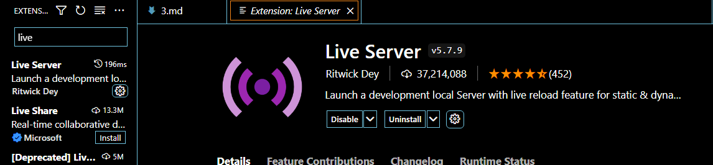
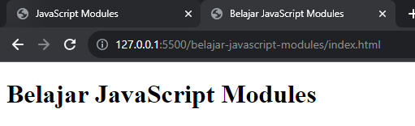

# Live Server

---

## Live Server
- Saat kita menggunakan fitur JavaScript Module, sangat disarankan untuk menjalankan kode avaScript kita dalam Web Server
- Hal ini karena spesifikasi dari JavaScript module meminta secara default kode JavaScript perlu di satu domain server yang sama, jika kita membuat file html menggunakan URL file://, maka dikhawatirkan akan terjadi error CORS (Cross Origin Resource Sharing) Visual Studio Code
- Jika menggunakan Visual Studio Code, disarankan untuk menginstall plugin Live Server : https://marketplace.visualstudio.com/items?itemName=ritwickdey.LiveServer

- Plugin Live Server ini bisa digunakan untuk menjalankan local web server, sehingga kita bisa mengakses kode web JavaScript kita menggunakan domain localhost

---

## JetBrains IDE
- Jika menggunakan JetBrains IDE, sudah terdapat fitur untuk membuka halaman web dalam local web server
- Tidak perlu menginstall plugin tambahan