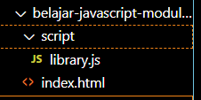
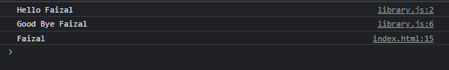

# Tanpa Module

---

## Tanpa Module

- Sebelum kita membahas JavaScript Module, sekarang kita akan coba dulu tanpa menggunakan module
- Saat kita membuat file JavaScript, lalu kita load file JavaScript tersebut di web, secara default semua kode JavaScript di file tersebut bisa diakses, baik itu variable, function atau class


---

## Kode : JavaScript Library

```js
function sayHello(name) {
    console.info(`Hello ${name}`);
}

function sayGoodBye(name) {
    console.info(`Good Bye ${name}`);
}

const name = "Faizal";
```

---

## Kode : Menggunakan Library

```html
<!DOCTYPE html>
<html lang="en">
<head>
    <meta charset="UTF-8">
    <meta http-equiv="X-UA-Compatible" content="IE=edge">
    <meta name="viewport" content="width=device-width, initial-scale=1.0">
    <title>Without Module</title>
    <script src="scripts/library.js"></script>
</head>
<body>
    <script>
        sayHello("Faizal");
        sayGoodBye("Faizal");

        console.log(name);
    </script>
</body>
</html>
```

**Hasil :**


---

## Dengan Module

- Namun jika kita menggunakan module, kita bisa secara selektif memilih bagian kode mana yang ingin kita ekspos keluar
- Secara default kode yang kita buat menggunakan JavaScript Module tidak bisa digunakan dari luar file, kecuali kita memintanya untuk mengekspos keluar