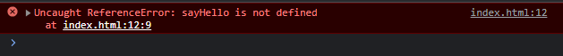

# Membuat Module

---

## Membuat Module

- Membuat module sangat sederhana, kita cukup membuat file JavaScript saja
- Yang membedakan adalah, saat kita akan meload file JavaScript dari HTML, kita tidak menggunakan type javascript lagi, melainkan menggunakan type module File .js dan .mjs
- Karena File JavaScript Module sebenarnya sama dengan JavaScript, kadang developer membedakan nama file untuk JavaScript Module menggunakan .mjs
- Hal ini sebenarnya tidak ada kewajiban, hanya saja agar mempermudah ketika tahapan development, kita bisa dengan mudah membedakan mana file JavaScript biasa, mana file JavaScript module hanya dengan extension file nya saja
- Pada kelas ini, kita akan tetap menggunakan file .js ketika membuat module, agar tidak membingungkan untuk pemula

---

## Kode : JavaScript Module

*say.js*

```js
function sayHello(name) {
    console.info(`Hello ${name}`);
}

function sayGoodBye(name) {
    console.info(`Good Bye ${name}`);
}

const name = "Faizal";
```

---

## Kode : Load JavaScript Module

```html
<!DOCTYPE html>
<html lang="en">
<head>
    <meta charset="UTF-8">
    <meta http-equiv="X-UA-Compatible" content="IE=edge">
    <meta name="viewport" content="width=device-width, initial-scale=1.0">
    <title>With Module</title>
    <script type="module" src="scripts/library.js"></script>
</head>
<body>
    <script>
        sayHello("Faizal");
        sayGoodBye("Faizal");

        console.log(name);
    </script>
</body>
</html>
```

---

## Hasil JavaScript Module



---

## Kenapa Error?

- Secara default, saat kita menggunakan fitur JavaScript Module, semua kode (function, variable, class dan lain-lain) tidak akan di ekspos keluar module tersebut
- Jika kita ingin mengekspos kode tersebut, kita harus memberitahunya secara eksplisit