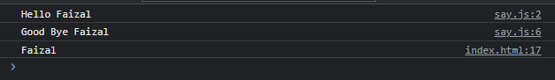

# Import

---

## Import

- Export digunakan untuk mengekspos kode di module, jika kita ingin menggunakan kode yang sudah di ekspos di module, kita bisa menggunakan kata kunci import
- Cara menggunakan kata kunci import adalah sebagai berikut : import {namaFunction, namaVariable, NamaClass} from “lokasi-module.js”
- Module hanya bisa digunakan di module lain, jadi pastikan ketika membuat script, kita harus menggunakan type module
- Saat menggunakan import, kita tidak perlu lagi menambahkan script module src satu per satu, karena sudah di handle oleh Browser secara otomatis ketika menggunakan module

---

## Kode : Import Module

```html
<!DOCTYPE html>
<html lang="en">
<head>
    <meta charset="UTF-8">
    <meta http-equiv="X-UA-Compatible" content="IE=edge">
    <meta name="viewport" content="width=device-width, initial-scale=1.0">
    <title>With Module</title>
    <script type="module" src="scripts/say.js"></script>
</head>
<body>
    <script type="module">
        import{sayHello, sayGoodBye, name} from "./scripts/say.js";

        sayHello("Faizal");
        sayGoodBye("Faizal");

        console.log(name);
    </script>
</body>
</html>
```

**Hasil :**

