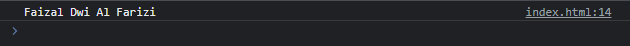

# Variable di Module

---

## Variable di Module

- Salah satu hal yang membingungkan pada variable di JavaScript adalah ketika kita membuat variable di global scope, maka variable tersebut bisa diubah nilainya oleh file JavaScript lain
- Saat kita menggunakan module, ketika kita buat variable, maka variable tersebut hanya berada pada module tersebut, tidak bisa digunakan di module lain

---

## Kode : Variable di Module

```js
const name = "Faizal Dwi Al Farizi";
```

---

## Kode : Menggunakan Variable Module

```html
<!DOCTYPE html>
<html lang="en">
<head>
    <meta charset="UTF-8">
    <meta http-equiv="X-UA-Compatible" content="IE=edge">
    <meta name="viewport" content="width=device-width, initial-scale=1.0">
    <title>Variable Module</title>
    <script type="module" src="scripts/variable.js"></script>
</head>
<body>
    <script type="module">
        console.log(name);
    </script>
</body>
</html>
```

---

## Export Variable di Module
- Jika kita ingin mengekspos variable ke luar module, kita juga bisa menggunakan kata kunci export di awal deklarasi variable nya

```js
export const name = "Faizal Dwi Al Farizi";
```

---

## Kode : Import Variable

```html
<!DOCTYPE html>
<html lang="en">
<head>
    <meta charset="UTF-8">
    <meta http-equiv="X-UA-Compatible" content="IE=edge">
    <meta name="viewport" content="width=device-width, initial-scale=1.0">
    <title>Variable Module</title>
    <script type="module" src="scripts/variable.js"></script>
</head>
<body>
    <script type="module">
        import {name} from "./scripts/variable.js";

        console.log(name);
    </script>
</body>
</html>
```

**Hasil :**

