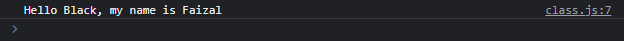

# Class di Module

---

## Class di Module

- Selain function dan juga variable, di module juga kita bisa menambahkan class
- Secara default, class tersebut hanya bisa diakses dari dalam module nya saja, tidak bisa diluar module
- Jika kita ingin mengekspos class yang kita buat, kita juga bisa menggunakan kata kunci export di awal deklarasi class nya

---

## Kode : Export Class di Module

*class.js*

```js
export class Person {
    constructor(name) {
        this.name = name;
    }

    sayHello(name) {
        console.log(`Hello ${name}, my name is ${this.name}`);
    }
}
```

---

## Kode : Menggunakan Class di Module

```js
import {Person} from "./scripts/class.js";

const person = new Person("Faizal");
person.sayHello("Black");
```

**Hasil :**

