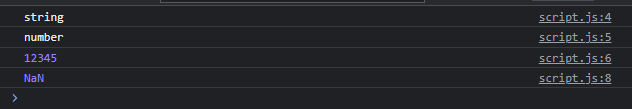
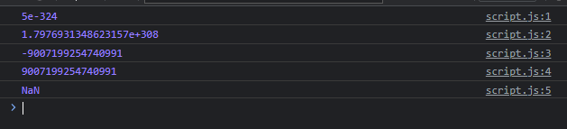
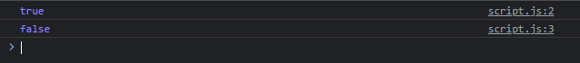
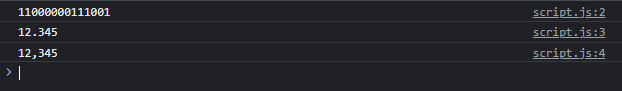

# Number

- Number merupakan function yang digunakan untuk melakukan konversi ke tipe data number
- Jika data tidak bisa dikonversi ke number, secara otomatis hasilnya adalah NaN
- https://developer.mozilla.org/en-US/docs/Web/JavaScript/Reference/Global_Objects/Number

---

## Kode : Number

```js
const input = "12345";
const number = Number(input);

console.log(typeof input);
console.log(typeof number);
console.log(number);

console.log(Number("salah"));
```

**Hasil :**



---

## Number Static Properties

- Number memiliki banyak static properties, seperti :
- Number.MIN_VALUE untuk mendapat number minimal
- Number.MAX_VALUE untuk mendapat number maksimal
- https://developer.mozilla.org/en-US/docs/Web/JavaScript/Reference/Global_Objects/Number#static_properties

---

## Kode : Number Static Properties

```js
console.log(Number.MIN_VALUE);
console.log(Number.MAX_VALUE);
console.log(Number.MIN_SAFE_INTEGER);
console.log(Number.MAX_SAFE_INTEGER);
console.log(Number.NaN);
```

**Hasil :**



---

## Number Static Method

- Number memiliki banyak static method, seperti :
- Number.isNaN(value) untuk mengecek apakah value NaN atau bukan
- Number.isInteger(value) untuk mengecek apakah value berupa integer atau bukan
- https://developer.mozilla.org/en-US/docs/Web/JavaScript/Reference/Global_Objects/Number#static_methods

---

## Kode : Number Static Method

```js
const data = Number("12345");
console.log(Number.isInteger(data));
console.log(Number.isNaN(data));
```

**Hasil :**



---

## Number Instance Method

- Number memiliki banyak instance method, seperti :
- Number.toLocalString(locale) untuk mengubah number menjadi string sesuai locale : https://www.lansweeper.com/knowledgebase/list-of-currency-culture-codes/
- Number.toString(radix) untuk mengubah number menjadi string sesuai radix
- https://developer.mozilla.org/en-US/docs/Web/JavaScript/Reference/Global_Objects/Number#instance_methods

---

## Kode : Number Instance Method

```js
const value = Number("12345");
console.log(value.toString(2)); // binnary
console.log(value.toLocaleString("id-ID")); // format indonesia
console.log(value.toLocaleString("en-US")); // format US
```

**Hasil :**

