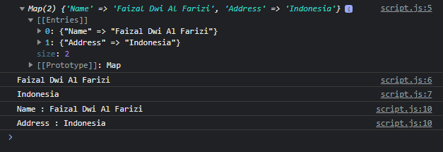

# Map

---

## Map

- Map merupakan representasi dari struktur data key-value
- Map mirip dengan tipe data object, hanya saja pada Map, semua method untuk manipulasi data sudah disediakan
- Map mengikuti kontrak iterable, sehingga bisa di iterasi secara default
- https://developer.mozilla.org/en-US/docs/Web/JavaScript/Reference/Global_Objects/Map

---

## Perbedaan Map dan Object

<table border="1" width="100%">
    <tr>
        <th>Map</th>
        <th>Object</th>
    </tr>
    <tr>
        <td>Pertama dibuat, tidak memiliki key</td>
        <td>Karena memiliki prototype, jadi bisa jadi memiliki default key ketika pertama dibuat</td>
    </tr>
    <tr>
        <td>Key bisa tipe data apapun</td>
        <td>Key hanya bisa string atau symbol</td>
    </tr>
    <tr>
        <td>Jumlah key bisa diketahui dengan mudah dengan attribute size</td>
        <td>Tidak bisa diketahui, harus manual menggunakan iteras</td>
    </tr>
    <tr>
        <td>Secara default tidak bisa dikonversi ke JSON</td>
        <td>Bisa dikonversi ke JSON secara otomatis</td>
    </tr>
</table>

---

## Map Instance Method & Property

<table border="1" width="100%">
    <tr>
        <th>Method & Property</th>
        <th>Keterangan</th>
    </tr>
    <tr>
        <td>size</td>
        <td>Panjang Map</td>
    </tr>
    <tr>
        <td>clear()</td>
        <td>Menghapus semua isi Map</td>
    </tr>
    <tr>
        <td>delete(key)</td>
        <td>Menghapus data Map berdasarkan key</td>
    </tr>
    <tr>
        <td>get(key) : value</td>
        <td>Mendapatkan data Map berdasarkan key</td>
    </tr>
    <tr>
        <td>has(key) : boolean</td>
        <td>Mengecek apakah Map berisi data key</td>
    </tr>
    <tr>
        <td>set(key, value)</td>
        <td>Mengubah data Map dengan key = value</td>
    </tr>
    <tr>
        <td>forEach((key, value) => ) </td>
        <td>Melakukan iterasi Map</td>
    </tr>
</table>

---

## Kode : Map

```js
const map = new Map();
map.set("Name", "Faizal Dwi Al Farizi");
map.set("Address", "Indonesia");

console.log(map);
console.log(map.get("Name"));
console.log(map.get("Address"));

for(const el of map) {
    console.log(`${el[0]} : ${el[1]}`);
}
```

**Hasil :**

