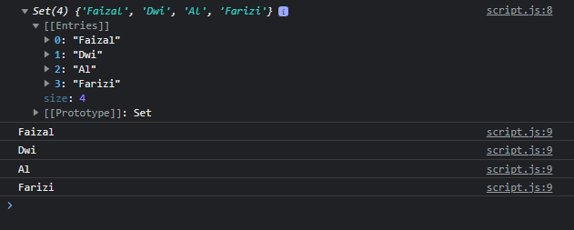

# Set

---

## Set

- Set merupakan implementasi dari struktur data yang berisikan data-data unique
- Set mirip seperti Array, hanya saja isi datanya selalu unique
- Jika kita menambahkan data yang sama, maka data hanya akan diterima satu saja
- Set mengimplementasikan kontrak iterable, sehingga bisa diiterasi secara default
- https://developer.mozilla.org/en-US/docs/Web/JavaScript/Reference/Global_Objects/Set

---

## Set Instance Method & Property

<table border="1" width="100%">
    <tr>
        <th>Method & Property</th>
        <th>Keterangan</th>
    </tr>
    <tr>
        <td>size</td>
        <td>Panjang Set</td>
    </tr>
    <tr>
        <td>add(value)</td>
        <td>Menambah data ke Set</td>
    </tr>
    <tr>
        <td>has(value)</td>
        <td>Mengecek apakah Set memiliki value</td>
    </tr>
    <tr>
        <td>delete(value)</td>
        <td>Menghapus value dari Set</td>
    </tr>
    <tr>
        <td>forEach(value => )</td>
        <td>Melakukan iterasi Set</td>
    </tr>
</table>

---

## Kode : Set

```js
const set = new Set();

set.add("Faizal");
set.add("Dwi");
set.add("Al");
set.add("Farizi");

console.log(set);
set.forEach(value => console.log(value));
```

**Hasil :**

