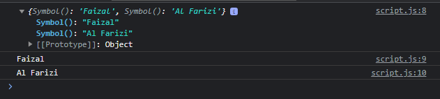
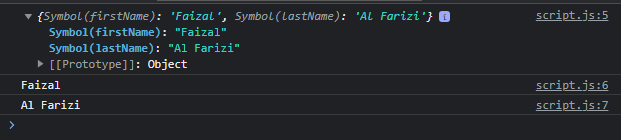

# Symbol

---

## Symbol

- Symbol merupakan tipe data yang digaransi akan selalu unique setiap kali kita membuat data symbol
- Symbol kadang banyak digunakan untuk membuat key pada object
- https://developer.mozilla.org/en-US/docs/Web/JavaScript/Reference/Global_Objects/Symbol

---

## Kode : Symbol

```js
const firstName = Symbol();
const lastName = Symbol();

const person = {};
person[firstName] = "Faizal";
person[lastName] = "Al Farizi";

console.log(person);
console.log(person[firstName]);
console.log(person[lastName]);
```

**Hasil :**



---

## Symbol For

- Kadang agak sulit membuat symbol harus selalu menggunakan variable
- Pembuatan symbol juga bisa menggunakan static method Symbol.for(key)
- Jika kita menggunakan key yang sama, Symbol yang sama akan sekalu dikembalikan

---

## Kode : Symbol For

```js
const person = {}
person[Symbol.for("firstName")] = "Faizal";
person[Symbol.for("lastName")] = "Al Farizi";

console.log(person);
console.log(person[Symbol.for("firstName")]);
console.log(person[Symbol.for("lastName")]);
```

**Hasil :**

