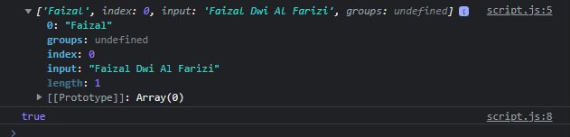
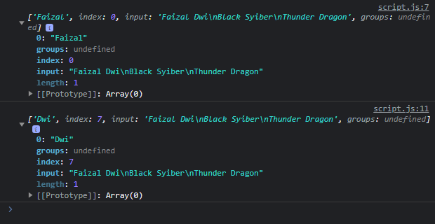
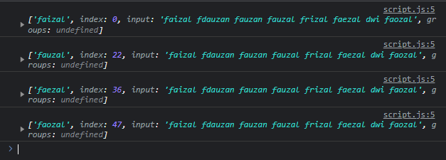
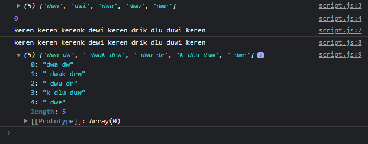

# RegExp

---

## RegExp

- RegExp merupakan implementasi dari regular expression di JavaScript
- Regular expression merupakan fitur untuk mencari text dengan pola
- Membuat regular expression di JavaScript bisa dilakukan dengan dua cara, yaitu menggunakan literal notation atau membuat object RegExp
- https://developer.mozilla.org/en-US/docs/Web/JavaScript/Reference/Global_Objects/RegExp

---

## Membuat RegExp

```js
const regex1 = /[a]/
const regex2 = new RegExp("[a]");
const regex3 = new RegExp(/[a]/);
```

---

## RegExp Instance Method

<table border="1" width="100%">
    <tr>
        <th>Instance Method</th>
        <th>Keterangan</th>
    </tr>
    <tr>
        <td>exec(value) : result</td>
        <td>Eksekusi regex, jika menemukan data sesuai pola, maka kembalikan result nya, jika tidak maka null</td>
    </tr>
    <tr>
        <td>test(value) : boolean</td>
        <td>Eksekusi regex, jika menemukan data sesuai pola, maka return true, jika tidak maka false</td>
    </tr>
</table>

---

## Kode : RegExp Instance Method

```js
const name = "Faizal Dwi Al Farizi";
const regex = /Faizal/;

let result = regex.exec(name);
console.log(result);

let test = regex.test(name);
console.log(test);
```

**Hasil :**



---

## RegExp Modifier

RegExp memiliki modifier untuk mengubah sifat cara pencarian :

<table border="1" width="100%">
    <tr>
        <th>Modifier</th>
        <th>Keterangan</th>
    </tr>
    <tr>
        <td>i</td>
        <td>Regex menjadi incase sensitive</td>
    </tr>
    <tr>
        <td>g</td>
        <td>Pencarian dilakukan secara global, secara default setelah menemukan data, pencarian akan berhenti</td>
    </tr>
    <tr>
        <td>m</td>
        <td>Multiline, pencarian dilakukan di tiap baris (enter)</td>
    </tr>
</table>

---

## Kode : RegExp Modifier

```js
const name = "Faizal Dwi\nBlack Syiber\nThunder Dragon";
const regex1 = /Faizal/g;
const regex2 = /Dwi/ig;

let result;
while((result = regex1.exec(name)) !== null) {
    console.log(result);
}

while((result = regex2.exec(name)) !== null) {
    console.log(result);
}
```

**Hasil :**



---

## Fitur RegExp Lainnya

- Assersions : indikasi awal dan akhir teks
  https://developer.mozilla.org/en-US/docs/Web/JavaScript/Guide/Regular_Expressions/Assertions
- Character Classes : membedakan antara huruf dan angka
  https://developer.mozilla.org/en-US/docs/Web/JavaScript/Guide/Regular_Expressions/Character_Classes
- Group dan Range : melakukan grouping atau range huruf atau angka
  https://developer.mozilla.org/en-US/docs/Web/JavaScript/Guide/Regular_Expressions/Groups_and_Ranges
- Quantifiers : menentukan jumlah huruf atau angka
  https://developer.mozilla.org/en-US/docs/Web/JavaScript/Guide/Regular_Expressions/Quantifiers

---

## Kode : Contoh Fitur RegExp

```js
const regex = /fa[aiueo]zal/ig;
const text = "faizal fdauzan fauzan fauzal frizal faezal dwi faozal";

while((result = regex.exec(text)) !== null) {
    console.log(result);
}
```

**Hasil :**



---

## Regular Expression di String

Di JavaScript, tipe data String memiliki instance method yang dapat memanfaatkan RegExp untuk melakukan pencarian :

<table border="1" width="100%">
    <tr>
        <th>String Method</th>
        <th>Keterangan</th>
    </tr>
    <tr>
        <td>match(regex) : Array</td>
        <td>Mencari semua data yang sesuai dengan regex</td>
    </tr>
    <tr>
        <td>search(regex) : index </td>
        <td>Mencari index data yang sesuai dengan regex</td>
    </tr>
    <tr>
        <td>replace(regex, value) </td>
        <td>Mengubah data dengan value yang sesuai regex</td>
    </tr>
    <tr>
        <td>replaceAll(regex, value)</td>
        <td>Mengubah semua data dengan value yang sesuai regex</td>
    </tr>
    <tr>
        <td>split(regex) : Array</td>
        <td>Memotong string dengan regex</td>
    </tr>
</table>

---

## Kode : Regular Expression di String

```js
const string = "dwa dwi dwak dewi dwu drik dlu duwi dwe";

console.log(string.match(/dw[aiueo]/ig));
console.log(string.search(/dw[aiueo]/ig));

// di replace semua karena regex
console.log(string.replace(/dw[aiueo]/ig, "keren"));
console.log(string.replaceAll(/dw[aiueo]/ig, "keren"));
console.log(string.split(/i/ig));
```

**Hasil :**

