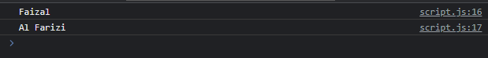
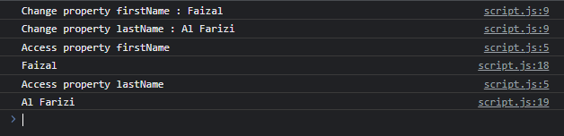

# Proxy

---

## Proxy

- Proxy merupakan fitur yang bisa digunakan sebagai wakil sebuah data
- Dengan menggunakan proxy, semua interaksi ke data akan selalu melalui Proxy terlebih dahulu
- Dengan ini, kita bisa melakukan apapun sebelum interaksi dilakukan ke data yang dituju
- https://developer.mozilla.org/en-US/docs/Web/JavaScript/Reference/Global_Objects/Proxy

---

## Proxy Handler

- Pembuatan Proxy perlu menggunakan handler, dimana dalam handler, kita bisa membuat function yang dinamakan interceptor yang digunakan ketika mengambil data atau mengubah data ke target
- Untuk membuat Proxy, kita bisa menggunakan new Proxy(target, handler)

---

## Kode : Membuat Handler

```js
const target = {}

const handler = {
    get: function(target, property) {
        return target[property];
    },
    set: function(target, property, value) {
        target[property] = value;
    }
}
```

---

## Kode : Membuat Proxy

```js
const proxy = new Proxy(target, handler);
proxy.firstName = "Faizal";
proxy.lastName = "Al Farizi";

console.log(proxy.firstName);
console.log(proxy.lastName);
```

---

## Digabung

```js
const target = {}

const handler = {
    get: function(target, property) {
        return target[property];
    },
    set: function(target, property, value) {
        target[property] = value;
    }
}

const proxy = new Proxy(target, handler);
proxy.firstName = "Faizal";
proxy.lastName = "Al Farizi";

console.log(proxy.firstName);
console.log(proxy.lastName);
```

**Hasil :**



---

## Proxy dan Handler

- Saat kita mengubah data proxy, secara otomatis data akan dikirim ke target melalui handler dengan memanggil function set(target, property, value)
- Saat kita mengambil data proxy, secara otomatis data akan diambil dari target melalui handler dengan memanggil function get(target, property)
- Artinya, jika kita ingin melakukan sesuatu sebelum dan setelah nya, bisa kita lakukan di handler

---

## Kode : Log Handler

```js
const target = {}

const handler = {
    get: function(target, property) {
        console.log(`Access property ${property}`);
        return target[property];
    },
    set: function(target, property, value) {
        console.log(`Change property ${property} : ${value}`);
        target[property] = value;
    }
}

const proxy = new Proxy(target, handler);
proxy.firstName = "Faizal";
proxy.lastName = "Al Farizi";

console.log(proxy.firstName);
console.log(proxy.lastName);
```

**Hasil :**

