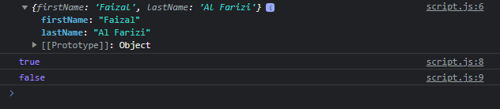

# Reflect

---

## Reflect

- Reflect merupakan class yang digunakan untuk mengeksekusi JavaScript function
- Reflect tidak memiliki constructor, dan cara penggunaan Reflect tidak dengan membuat object dengan new Reflect
- Penggunaan Reflect adalah menggunakan banyak sekali static methodnya
- https://developer.mozilla.org/en-US/docs/Web/JavaScript/Reference/Global_Objects/Reflect

---

## Kode : Reflect

```js
const person = {};

Reflect.set(person, "firstName", "Faizal");
Reflect.set(person, "lastName", "Al Farizi");

console.log(person);

console.log(Reflect.has(person, "firstName")); // true
console.log(Reflect.has(person, "middleName")); // false
```

**Hasil :**

