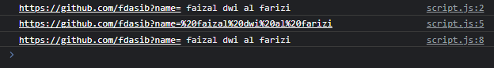
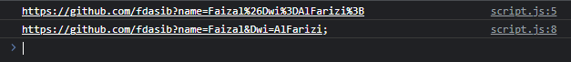

# Encode

---

## Encode

- Saat kita menulis URL, kadang kita ingin menambahkan informasi tambahan seperti query parameter misalnya
- URL sendiri sudah memiliki standard encoding penulisan URL
- Standard encoding ini dilakukan agar penulisan URL aman ketika diterima oleh server
- Aman disini dalam artian informasi URL tidak berubah
- Contoh paling sederhana, misal, walaupun kita bisa mengirim spasi dalam url, tapi disarankan untuk di encode agar nilai spasi tidak benar-benar terlihat seperti spasi pada URL nya

---

## Contoh Masalah Jika Tidak Menggunakan Encode

- Misal ada query parameter dengan nama data, lalu kita ingin mengirimkan nilai kesana
- Misal nilainya adalah &eko=eko&, alhasil URL nya akan seperti berikut
- http://contoh.com?data=&eko=eko&
- URL diatas terlihat tidak ada masalah, tapi sebenarnya ketika diterima oleh server, parameter data bernilai kosong, kenapa? karena & dianggap sebagai pemisah antar parameter
- Artinya tanda seperti & dan lain-lain perlu di encode, agar tidak terjadi kesalahan data yang kita kirim

---

## Encode Function

<table border="1" width="100%">
    <tr>
        <th>Function</th>
        <th>Keterangan</th>
    </tr>
    <tr>
        <td>encodeURI(value)</td>
        <td>Melakukan encode value, namun karakter yang dipesan di URI tidak akan diubah ;,/?:@&=+$#</td>
    </tr>
    <tr>
        <td>encodeURIComponent(value)</td>
        <td>Melakukan encode value semua karakter</td>
    </tr>
    <tr>
        <td>decodeURI(encoded) </td>
        <td>Melakukan decode value hasil encodeURI()</td>
    </tr>
    <tr>
        <td>decodeURIComponent(encoded) </td>
        <td>Melakukan decode value hasil encodeURIComponent()</td>
    </tr>
</table>

---

## Kode : encodeURI dan decodeURI

```js
const url = 'https://github.com/fdasib?name= faizal dwi al farizi';
console.log(url);

const encoded = encodeURI(url);
console.log(encoded);

const decoded = decodeURI(encoded);
console.log(decoded);
```

**Hasil :**



---

## Kode : encodeURIComponent dan decodeURICompoentn

```js
const value = "Faizal&Dwi=AlFarizi;";
const url = 'https://github.com/fdasib?name=';

const encoded = encodeURIComponent(value);
console.log(url + encoded);

const decoded = decodeURIComponent(encoded);
console.log(url + decoded);
```

**Hasil :**

