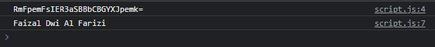

# Base64

---

## Base64

- Base64 merupakan binary to text encoding, representasi binary data dalam format string
- Base64 merupakan format text data yang aman untuk dikirimkan di web
- Base64 merupakan encoding yang biasanya digunakan ketika perlu mengirim data dari client ke server
- Karena encoding Base64 merupakan text, oleh karena itu sangat aman digunakan pada query param URL atau text body dalam form
- https://developer.mozilla.org/en-US/docs/Glossary/Base64

---

## Base64 Function

JavaScript memiliki function bawaan untuk melakukan encode Base64 atau decode base64

<table border="1" width="100%">
    <tr>
        <th>Function</th>
        <th>Keterangan</th>
    </tr>
    <tr>
        <td>btoa(value)</td>
        <td>Encode ke base64 dari value</td>
    </tr>
    <tr>
        <td>atob(encoded)</td>
        <td>Decode dari base64 ke value</td>
    </tr>
</table>

---

## Kode : Base64

```js
const original = "Faizal Dwi Al Farizi";

const encoded = btoa(original);
console.log(encoded);

const decoded = atob(encoded);
console.log(decoded);
```

**Hasil :**

