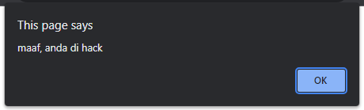

# Eval

---

## Eval

- Eval merupakan function yang digunakan untuk mengeksekusi kode JavaScript dari String
- Fitur ini sangat menarik, namun perlu hati-hati ketika menggunakannya
- Jika sampai salah penggunaan, maka bisa jadi kita malah mengeksekusi kode program yang bisa menyebabkan masalah keamanan di website kita
- https://developer.mozilla.org/en-US/docs/Web/JavaScript/Reference/Global_Objects/eval

---

## Kode : Eval

```js
const script = "alert('maaf, anda di hack')";

eval(script);
```

**Hasil :**

