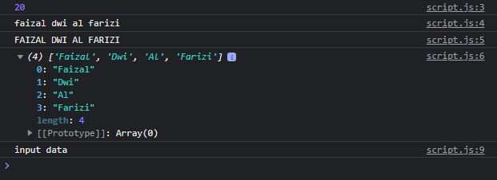

# String

---

## String

- Tipe data String sudah kita bahas pada materi JavaScript Dasar
- Namun kita belum membahas instance method atau juga instance properties yang terdapat di String
- https://developer.mozilla.org/en-US/docs/Web/JavaScript/Reference/Global_Objects/String

---

## String Instance Method dan Properties

- String sendiri memiliki banyak sekali instance method dan properties
- Hal ini menjadikan untuk memanipulasi data String sangat mudah di JavaScript, seperti mengubah menjadi lowercase, UPPERCASE, memotong string menjadi array dan lain-lain
- https://developer.mozilla.org/en-US/docs/Web/JavaScript/Reference/Global_Objects/String#instance_methods

---

## Kode : String Instance Method dan Properties

```js
const name = "Faizal Dwi Al Farizi";

console.log(name.length);
console.log(name.toLowerCase());
console.log(name.toUpperCase());
console.log(name.split(" "));

const input = "     input data      ";
console.log(input.trim());
```

**Hasil :**

