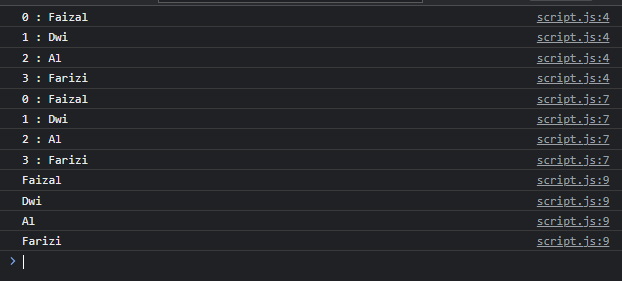
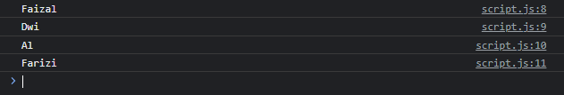
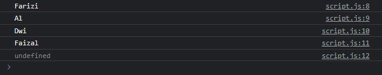
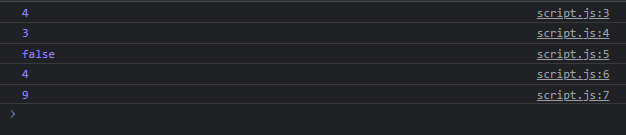
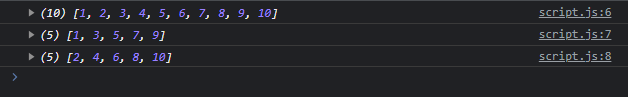
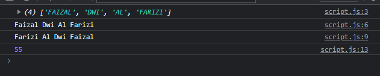

# Array

- Tipe data Array sudah kita bahas di materi JavaScript Dasar
- Namun kita hanya membahas beberapa instance method yang ada di Array
- Sebenarnya, terdapat banyak sekali Instance Method yang ada di Array, dan kita akan coba bahas beberapa di sini
- https://developer.mozilla.org/en-US/docs/Web/JavaScript/Reference/Global_Objects/Array

---

## Array Loop

- Sebelumnya kita biasa menggunakan for in dan for of untuk melakukan iterasi Array, namun Array juga memiliki method yang bernama forEach()
- Method forEach bisa digunakan juga untuk melakukan iterasi data array

---

## Kode : Array Loop

```js
const array = ["Faizal", "Dwi", "Al", "Farizi"];

array.forEach(function(value, index) {
    console.log(`${index} : ${value}`);
});

array.forEach((value, index) => console.log(`${index} : ${value}`));

array.forEach(value => console.log(value));
```

**Hasil :**



---

## Array Queue

- Dalam struktur data, terdapat tipe struktur data bernama Queue (Antrian)
- Dimana data masuk akan diposisikan di urutan paling belakang
- Sedangkan data keluar akan diposisikan dari urutan paling depan
- Mirip sekali dengan antrian, atau istilahnya FIFO (first in first out)
- Kita bisa menggunakan Array dengan bantuan function push() untuk menambah data di belakang, dan shift() untuk mengambil dan menghapus data paling depan

---

## Kode : Array Queue

```js
const queue = [];

queue.push("Faizal");
queue.push("Dwi");
queue.push("Al");
queue.push("Farizi");

console.log(queue.shift());
console.log(queue.shift());
console.log(queue.shift());
console.log(queue.shift());
```

**Hasil :**



---

## Array Stack

- Struktur data Stack (Tumpukan) kebalikan dari Queue, dimana aturannya mirip dengan tumpukan kartu
- Saat kita memasukkan data, kita akan memasukkan di urutan paling belakang (atau atas)
- Sedangkan saat kita mengambil data, kita akan mengambil data dari paling belakang (atau atas) terlebih dahulu
- Stack ini sifatnya LIFO (last in first out)
- Untuk menambah diurutan belakang, kita bisa menggunakan function push()
- Dan untuk mengambil dan menghapus paling belakang, kita bisa menggunakan function pop()

---

## Kode : Array Stack

```js
const stack = [];

stack.push("Faizal");
stack.push("Dwi");
stack.push("Al");
stack.push("Farizi");

console.log(stack.pop());
console.log(stack.pop());
console.log(stack.pop());
console.log(stack.pop());
console.log(stack.pop());
```

**Hasil :**



---

## Array Search

Array memiliki banyak function untuk melakukan pencarian :

<table border="1" width="100%">
    <tr>
        <th>Function</th>
        <th>Keterangan</th>
    </tr>
    <tr>
        <td>find(value => boolean) : value </td>
        <td>Mencari data sesuai dengan kondisi</td>
    </tr>
    <tr>
        <td>findIndex(value => boolean) : number</td>
        <td>Mencari data index sesuai dengan kondisi</td>
    </tr>
    <tr>
        <td>includes(value) : boolean</td>
        <td>Mengecek apakah terdapat data</td>
    </tr>
    <tr>
        <td>indexOf(value) : number</td>
        <td>Mengecek posisi index data</td>
    </tr>
    <tr>
        <td>lastIndexOf(value) : number </td>
        <td>Mengecek posisi index data terakhir</td>
    </tr>
</table>

---

## Kode : Array Search

```js
const source = [1, 2, 3, 4, 5, 1, 2, 3, 4, 5];

console.log(source.find(value => value > 3)); // 4
console.log(source.findIndex(value => value > 3)); // 3
console.log(source.includes(7)); // false
console.log(source.indexOf(5)); // 4
console.log(source.lastIndexOf(5)); // 9
```

**Hasil :**



---

## Array Filter

Array memiliki function untuk melakukan filter data : 

<table border="1" width="100%">
    <tr>
        <th>Function</th>
        <th>Keterangan</th>
    </tr>
    <tr>
        <td>filter(value => boolean) : Array </td>
        <td>Melakukan filter data yang kondisinya bernilai true</td>
    </tr>
</table>

---

## Kode : Array Filter

```js
const numbers = [1, 2, 3, 4, 5, 6, 7, 8, 9, 10];

const ganjil = numbers.filter(value => value % 2 === 1);
const genap = numbers.filter(value => value % 2 === 0);

console.log(numbers);
console.log(ganjil);
console.log(genap);
```

**Hasil :**



---

## Array Transform

Array juga memiliki function yang digunakan untuk melakukan transformasi :

<table border="1" width="100%">
    <tr>
        <th>Function</th>
        <th>Keterangan</th>
    </tr>
    <tr>
        <td>map(value => result) : Array<result></td>
        <td>Melakukan transform tiap value dan menghasilkan array result</td>
    </tr>
    <tr>
        <td>reduce(resultBefore, value => result) : result</td>
        <td>Melakukan transform dengan menggunakan value array dan value selanjutnya, lalu hasilnya dilanjutkan ke iterasi selanjutnya
</td>
    </tr>
    <tr>
        <td>reduceRight(resultBefore, value => result)</td>
        <td>Sama seperti reduce(), namun dilakukan dari belakang</td>
    </tr>
</table>

---

## Kode : Array Transform

```js
const names = "Faizal Dwi Al Farizi".split(" ");
const namesUpper = names.map(value => value.toUpperCase());
console.log(namesUpper);

const namesReduce = names.reduce((before, value) => before + " " + value);
console.log(namesReduce);

const namesRight = names.reduceRight((before, value) => before + " " + value);
console.log(namesRight);

const numbers = [1, 2, 3, 4, 5, 6, 7, 8, 9, 10];
const total = numbers.reduce((result, value) => result + value);
console.log(total);
```

**Hasil :**


---

## Dan Function lain-lain

- https://developer.mozilla.org/en-US/docs/Web/JavaScript/Reference/Global_Objects/Array#instance_methods

