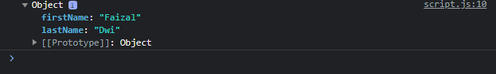
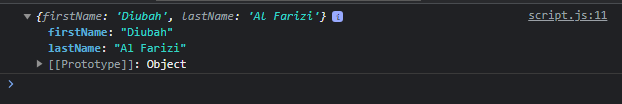
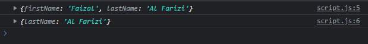
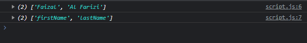

# Object

---

## Object

- Tipe data object sudah sering sekali kita bahas di JavaScript Dasar dan JavaScript OOP
- Pada materi ini, kita akan bahas banyak static method yang terdapat pada Object
- https://developer.mozilla.org/en-US/docs/Web/JavaScript/Reference/Global_Objects/Object

---

## Object Freeze & Seal

- Secara default, object bisa diubah atau dihapus properties nya
- Jika kita ingin mengubah sebuah object menjadi object yang tidak bisa diubah atau dihapus, kita bisa menggunakan beberapa static method
- Object.freeze() digunakan untuk mengubah object menjadi object yang tidak bisa diubah atau dihapus attribute nya
- Object.seal() digunakan untuk mengubah object menjadi object yang tidak bisa dihapus attribute nya

---

## Kode : Object Freeze

```js
const person = {
    firstName: "Faizal",
    lastName: "Dwi"
}

Object.freeze(person);

person.firstName = "Diubah"; // tidak berubah
delete person.lastName; // tidak berubah
console.log(person);
```

**Hasil :**



---

## Kode : Object Seal

```js
const person = {
    firstName: "Faizal",
    lastName: "Al Farizi"
}

Object.seal(person); // hanya bisa mengubah

person.firstName = "Diubah"; // berubah
person.middleName = "Dwi"; // tidak ditambah
delete person.lastName; // tidak terhapus
console.log(person);
```

**Hasil :**



---

## Object Assign

- Kadang kita ada kasus menggabungkan semua attribute dari sebuah object ke object lain
- Hal ini bisa kita lakukan dengan menggunakan Object.assign(target, source)

---

## Kode : Object Assign

```js
const target = {firstName: "Faizal"};
const source = {lastName: "Al Farizi"};

Object.assign(target, source);
console.log(target);
console.log(source);
```

**Hasil :**



---

## Object Property Name & Value

- Object juga memiliki static method untuk digunakan mengambil semua properties names dan values
- Object.values() digunakan untuk mengambil semua property value
- Object.getPropertyNames() digunakan untuk mengambil semua properti name

---

## Kode : Object Property Name & Value

```js
const person = {
    firstName: "Faizal",
    lastName: "Al Farizi"
}

console.log(Object.values(person));
console.log(Object.getOwnPropertyNames(person));
```

**Hasil :**



---

## Dan Function Lain-Lain

- https://developer.mozilla.org/en-US/docs/Web/JavaScript/Reference/Global_Objects/Object

