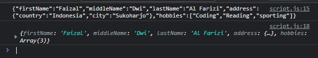

# JSON

---

## Pengenalan JSON

- JSON singkatan dari JavaScript Object Notation
- JSON merupakan data String yang bentuknya mirip dengan JavaScript Object
- Saat ini JSON banyak sekali digunakan untuk komunikasi antara Server dan Client
- https://www.json.org/json-en.html

---

## JSON

- JavaScript mendukung konversi data dari String json ke Object ataupun sebaliknya
- JSON.stringify() digunakan untuk melakukan konversi dari Object ke String
- JSON.parse() digunakan untuk melakukan konversi dari String ke Object
- https://developer.mozilla.org/en-US/docs/Web/JavaScript/Reference/Global_Objects/JSON

---

## Kode : JSON

```js
const person = {
    firstName: "Faizal",
    middleName: "Dwi",
    lastName: "Al Farizi",
    address: {
        country: "Indonesia",
        city: "Sukoharjo"
    },
    hobbies: [
        "Coding", "Reading", "sporting"
    ]
}

const json = JSON.stringify(person);
console.log(json);

const jsonObject = JSON.parse(json);
console.log(jsonObject);
```

**Hasil :**


