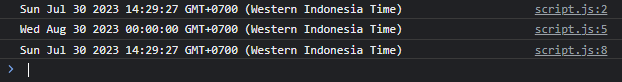
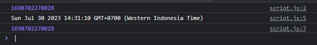
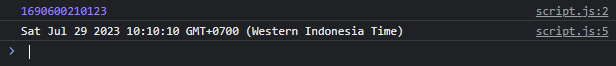
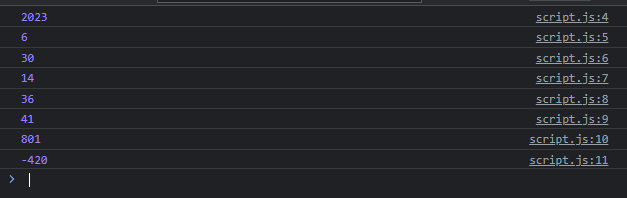

# Date

---

## Date

- JavaScript memiliki tipe data untuk representasi waktu dan tanggal, yaitu Date
- Date merupakan representasi milisecond sejak tanggal 1 Januari 1970, atau dikenal dengan Epoch & Unix Timestamp
- https://developer.mozilla.org/en-US/docs/WebJavaScript/Reference/Global_Objects/Date

---

## Membuat Object Date

Untuk membuat object Date, kita bisa menggunakan new Date(), dimana terdapat constructor parameter : 

<table border="1" width="100%">
    <tr>
        <td>new Date()</td>
        <td>Membuat date saat ini</td>
    </tr>
    <tr>
        <td>new Date(year, month, date</td>
        <td>Membuat date dengan tanggal</td>
    </tr>
    <tr>
        <td>new Date(year, month, date?, hour?, minute?, second?, milis?)</td>
        <td>Membuat date dengan parameter sampai milis</td>
    </tr>
    <tr>
        <td>new Date(timestamp)</td>
        <td>Membuat date dari epoch atau unix timestamp</td>
    </tr>
</table>

---

## Kode : Membuat Object Date

```js
const date1 = new Date();
console.log(date1);

const date2 = new Date(2023, 07, 30);
console.log(date2);

const date3 = Date(2023, 07, 30, 1, 0, 0, 0);
console.log(date3);
```

**Hasil :**



---

## Epoch & Unix Timestamp

- Dalam menggunakan tipe data waktu, biasanya disemua bahasa pemrograman akan mendukung yang namanya epoch & unix timestamp
- Epoch & Unix timestamp merupakan hitungan miliseconds setelah tanggal 1 Januari 1970
- JavaScript pun mendukung pembuatan waktu dalam bentuk epoch dan unix timestamp
- Untuk mendapatkan waktu saat ini dalam epoch & unix timestamp, kita bisa menggunakan Date.now()
- Untuk mengubah dari object date ke epoch & unix timestamp, kita bisa menggunakan function getTime()

---

## Kode : Unix Timestamp

```js
const timestamp = Date.now();
console.log(timestamp);

const dateUnix = new Date(timestamp);
console.log(dateUnix);

console.log(dateUnix.getTime());
```

**Hasil :**



---

## Parsing Date

- Kita juga bisa melakukan parsing membuat date dari string menggunakan method Date.parse(value)
- Format string harus YYYY-MM-DDTHH:mm:ss.sssZ
- Dimana jika kita hanya membuat date berisi tanggal saya, kita cukup gunakan YYYY-MM-DD
- Jika date dengan tanggal dan waktu, gunakan YYYY-MM-DDTHH:mm:ss.sss
- Jika date dengan tanggal, waktu dan timezone, gunakan YYYY-MM-DDTHH:mm:ss.sssZ
- Hasil parsing adalah unix timestamp, bukan object date

---

## Format Date

<table border="1" width="100%">
    <tr>
        <td>YYYY</td>
        <td>Tahun</td>
    </tr>
    <tr>
        <td>MM</td>
        <td>Bulan</td>
    </tr>
    <tr>
        <td>DD</td>
        <td>Tangal</td>
    </tr>
    <tr>
        <td>T</td>
        <td>Pemisah tanggal dan waktu</td>
    </tr>
    <tr>
        <td>HH</td>
        <td>Jam</td>
    </tr>
    <tr>
        <td>mm</td>
        <td>Menit</td>
    </tr>
    <tr>
        <td>ss</td>
        <td>Detik</td>
    </tr>
    <tr>
        <td>sss</td>
        <td>Milidetik</td>
    </tr>
    <tr>
        <td>Z</td>
        <td>Timezone</td>
    </tr>
</table>

---

## Kode : Parsing Date

```js
const parseTimestamp = Date.parse("2023-07-29T10:10:10.123+07:00")
console.log(parseTimestamp);

const parseDate = new Date(parseTimestamp);
console.log(parseDate);
```

**Hasil :**



---

## Date Getter dan Setter

- Date juga memiliki banyak sekali method untuk mendapatkan informasi date dan juga mengubah informasi date, atau istilahnya adalah getter dan setter
- https://developer.mozilla.org/en-US/docs/Web/JavaScript/Reference/Global_Objects/Date#instance_methods

---

## Kode : Date Getter dan Setter

```js
const date = new Date();
date.setFullYear(2023);

console.log(date.getFullYear());
console.log(date.getMonth());
console.log(date.getDate());
console.log(date.getHours());
console.log(date.getMinutes());
console.log(date.getSeconds());
console.log(date.getMilliseconds());
console.log(date.getTimezoneOffset());
```

**Hasil :**

