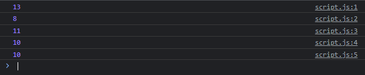

# Math

---

## Math

- Math merupakan class di JavaScript yang berisikan static property dan method untuk operasi matematika
- Ada banyak sekali static property dan method di Math
- Math hanya bisa digunakan untuk tipe data Number, tidak bisa digunakan untuk tipe data BigInt
- https://developer.mozilla.org/en-US/docs/Web/JavaScript/Reference/Global_Objects/Math

---

## Kode : Math

```js
console.log(Math.max(10, 11, 9, 13, 8)); // 13
console.log(Math.min(10, 11, 9, 13, 8)); // 8
console.log(Math.round(10.5)); // 11
console.log(Math.round(10.3)); // 10
console.log(Math.floor(10.8)); // 10
```

**Hasil :**

