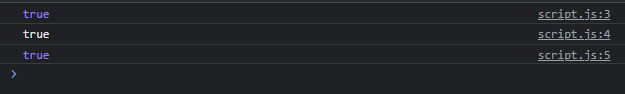

# Boolean

---

## Boolean

- Boolean merupakan wrapper class untuk tipe primitif boolean
- Boolean memiliki method toString() untuk mengkonversi ke String
- Dan memiliki method valueOf() untuk mengkonversi ke tipe boolean primitif
- https://developer.mozilla.org/en-US/docs/Web/JavaScript/Reference/Global_Objects/Boolean

---

## Kode Boolean

```js
const boolean = Boolean(true);

console.log(boolean);
console.log(boolean.toString());
console.log(boolean.valueOf());
```

**Hasil :**

