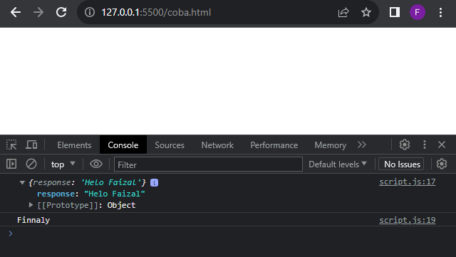
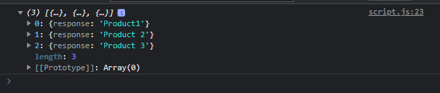

# Promise Method

---

## Promise Method

- Promise memiliki tiga method yang bisa kita gunakan
- then() untuk mendapatkan atau mengubah data ketika Promise sukses
- catch() untuk mendapatkan data error ketika Promise gagal
- finally() akan dieksekusi ketika terjadi sukses atau gagal pada Promise
- https://developer.mozilla.org/en-US/docs/Web/JavaScript/Reference/Global_Objects/Promise#instance_methods

---

## Kode : Promise Method

```js
function getProduct() {
    return new Promise(function(resolve, reject) {
        const ajax = new XMLHttpRequest();
        ajax.open("GET", "api/product.json");
        ajax.onload = function() {
            if(ajax.status === 200) {
                resolve(JSON.parse(ajax.responseText));
            } else {
                reject(ajax.responseText);
            }
        }
        ajax.send();
    });
}

getProduct()
    .then((response) => console.log(response))
    .catch((error) => console.error(error))
    .finally(() => console.log("Finnaly"));
```

**Hasil :**



**jika error**

**Hasil :**


---

## Promise Static Method

- Promise juga memiliki beberapa static method
- Promise.all() digunakan untuk mengeksekusi beberapa promise sekaligus dan menunggu semua hasil promise nya
- Promise.any() digunakan untuk mengeksekusi beberapa promise sekaligus dan mengambil hasil promise paling cepat
- Dan lain-lain
- https://developer.mozilla.org/en-US/docs/Web/JavaScript/Reference/Global_Objects/Promise#static_methods

---

## Kode : Get Product Function

```js
function getProduct(product) {
    return new Promise(function(resolve, reject) {
        const ajax = new XMLHttpRequest();
        ajax.open("GET", `api/${product}.json`);
        ajax.onload = function() {
            if(ajax.status === 200) {
                resolve(JSON.parse(ajax.responseText));
            } else {
                reject(ajax.responseText);
            }
        }
        ajax.send();
    });
}

const response = Promise.all([
    getProduct("product1"),
    getProduct("product2"),
    getProduct("product3")
]);

response
    .then((values) => console.log(values))
    .catch((error) => console.log(error));
```

**Hasil :**


