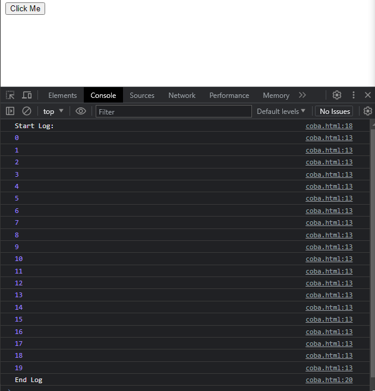
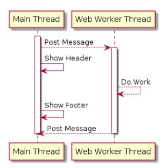
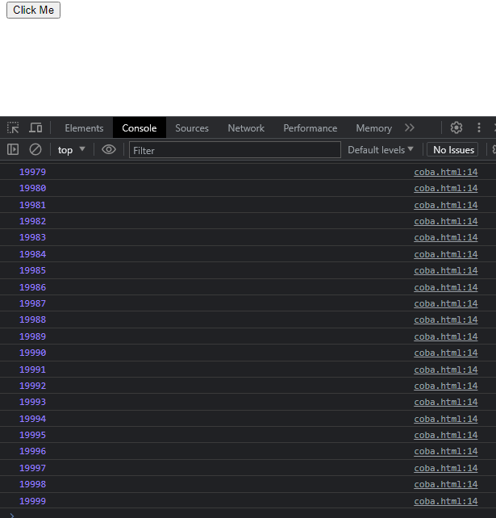

# Web Worker

---

## Thread di JavaScript

- JavaScript adalah Single Thread (Single Proses), artinya walaupun proses yang kita buat adalah Async, tapi tetap akan dijalankan dalam Thread (Proses) yang sama.
- Kemampuan satu Thread dalam mengelola beberapa pekerjaan, dinamakan Concurrent.
- Kemampuan menjalankan beberapa Thread untuk mengelola satu atau lebih pekerjaan, dinamakan Paralel.
- Dan untuk membuat proses secara Paralel, kita bisa menggunakan Web Worker

---

## Kode : Proses Lambat

```html
<!DOCTYPE html>
<html lang="en">
<head>
    <meta charset="UTF-8">
    <meta name="viewport" content="width=device-width, initial-scale=1.0">
    <title>Document</title>
</head>
<body>
    <button id="buttonTask">Click Me</button>
    <script>
        function showLog(total) {
            for(let i = 0; i < total; i++) {
                console.log(i);
            }
        }

        document.getElementById("buttonTask").onclick = function() {
            console.log("Start Log:");
            showLog(20);
            console.log("End Log");
        }
    </script>
</body>
</html>
```

**Hasil :**



---

## Web Worker

- Web Worker adalah kemampuan yang untuk menjalankan proses di Thread yang berbeda dibanding Main Thread.
- Keuntungan menggunakan Web Worker adalah, jika terdapat proses yang membutuhkan waktu lama, Web kita tidak akan Freeze, karena proses tersebut bisa kita jalankan di Thread yang berbeda dari Main Thread (yang biasa digunakan oleh UI)
- https://developer.mozilla.org/en-US/docs/Web/API/Web_Workers_API

---

## Diagram Web Worker



---

## Worker

- Untuk menggunakan Web Worker API, kita bisa membuat object Worker
- https://developer.mozilla.org/en-US/docs/Web/API/Worker
- Saat kita membuat object Worker, Worker tidak akan secara otomatis berjalan, melainkan kita perlu memberi perintah dengan cara mengirim pesan
- Untuk mengirim pesan, kita bisa gunakan method postMessage()
- Sedangkan untuk menerima balasan dari worker, kita bisa menggunakan event listener onmessage
- Data yang diterima adalah object MessageEvent
- https://developer.mozilla.org/en-US/docs/Web/API/MessageEvent

---

## Kode : Membuat Worker

*index.html*

```html
<!DOCTYPE html>
<html lang="en">
<head>
    <meta charset="UTF-8">
    <meta name="viewport" content="width=device-width, initial-scale=1.0">
    <title>Document</title>
</head>
<body>
    <button id="buttonTask">Click Me</button>
    <script>
        const worker = new Worker("scripts/worker.js");
        // worker.onmessage = callback
        worker.addEventListener("message", function(message) {
            console.log(message.data);
        });

        document.getElementById("buttonTask").onclick = function() {
            worker.postMessage(20000);
        }
    </script>
</body>
</html>
```

---

## Kode : File Worker

*worker.js*

```js
addEventListener("message", function(event) {
    const total = event.data;
    for(let i = 0; i < total; i++) {
        this.postMessage(i);
    }
});
```

**Hasil :**



