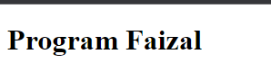
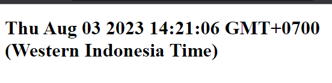

# Callback

---

## Apa itu Callback?

- Callback, merupakan mekanisme untuk memanggil kembali kode yang ada di program dari proses Async
- Callback biasanya dibuat dalam bentuk function as parameter, dan parameter function tersebut akan dieksekusi saat proses Async selesai
- Dengan menggunakan Callback, program bisa menerima informasi yang dibutuhkan dari proses yang berjalan secara Async

---

## Async Method

ada banyak method Async yang terdapat di JavaScript, yang akan kita bahas kali ini adalah :
- setTimeout(callback, timeInMilis), digunakan untuk menjalankan proses Async sekali dalam waktu tertentu.
- setInterval(callback, timeInMilis), digunakan untuk menjalankan proses Async secara periodik dalam waktu tertentu.

---

## Kode : setTimeout

```js
const addElement = () => {
    const header = document.createElement("h1");
    header.textContent = "Program Faizal";

    document.body.appendChild(header);
}

setTimeout(addElement, 5000);
```

**Hasil :**



---

## Kode : setInterval

```html
<h1 id="header"></h1>
<script>
    const setTime = () => {
        const header = document.getElementById("header");
        header.textContent = new Date().toString();

        document.body.appendChild(header);
    }

    setInterval(setTime, 1000);
</script>
```

**Hasil :**

