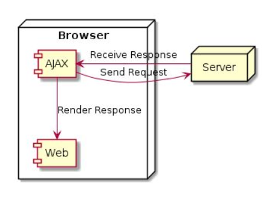
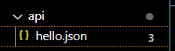
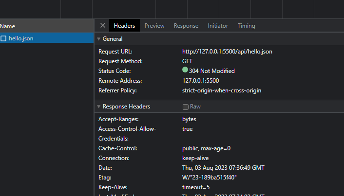

# AJAX

---

## Apa itu AJAX?

- AJAX singkatan dari Asynchronous JavaScript and XML
- AJAX biasanya digunakan untuk mengambil atau mengirim data ke URL lain
- Untuk membuat AJAX, kita bisa menggunakan class XMLHttpRequest
- https://developer.mozilla.org/en-US/docs/Web/API/XMLHttpRequest

---

## Cara Kerja AJAX



---

## Kode : Membuat AJAX

Membuat folder *api* dan file *hello.json*



isi script *hello.json* :

```json
{
    "response": "Helo Faizal"
}
```

isi file *script.js* : 

```js
const ajax = new XMLHttpRequest();
ajax.open("GET", "api/hello.json");
// ajax.open("GET", "http://localhost:8080/api/hello.json");

ajax.send(); // mengirim request
```

## Melihat Komunikasi ajaxnya

1. Buka inspect
2. Network
3. Fetch/XHR
4. tekan ctrl + R terlebih dahulu agar muncul

