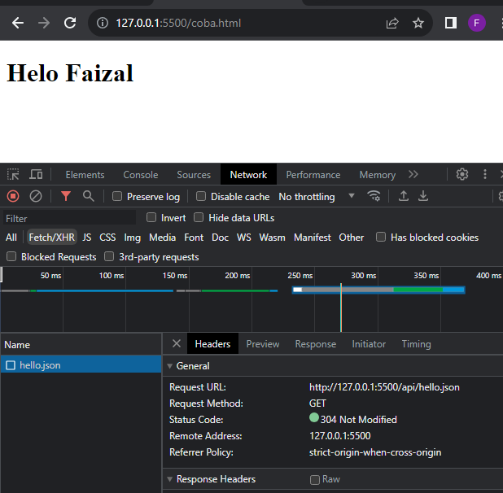

# Menerima Data di AJAX

---

## Menerima Data di AJAX

- AJAX biasanya digunakan untuk mengirim data ke Server atau menerima data dari Server
- Tiap request AJAX yang dilakukan, biasanya kita ingin mendapat informasi response yang diberikan oleh Server
- Kita tidak bisa langsung mengambil response AJAX, karena proses AJAX adalah Async, sehingga kita perlu menunggu sampai proses Async nya selesai.
- Untuk mendapatkan informasi AJAX, kita bisa menggunakan AJAX Callback, yang akan dieksekusi setelah proses AJAX selesai
- Untuk menambahkan AJAX Callback, kita bisa tambahkan pada event load
- https://developer.mozilla.org/en-US/docs/Web/API/XMLHttpRequest/load_event
- Dan untuk mengambil datanya dari server, kita bisa menggunakan property responseText

---

## Kode : Menerima Data di AJAX

*index.html*

```html
<h1 id="response"></h1>
<script src="scripts/script.js"></script>
```

*script.js*

```js
const ajax = new XMLHttpRequest();
ajax.open("GET", "api/hello.json");

//ajax.onload = callback; // menggunakan onload
ajax.addEventListener("load", function() {
    const json = JSON.parse(ajax.responseText);
    const response = document.getElementById("response");
    response.textContent = json.response;
    document.body.appendChild(response);
});

ajax.send(); // mengirim request
```

**Hasil :**

