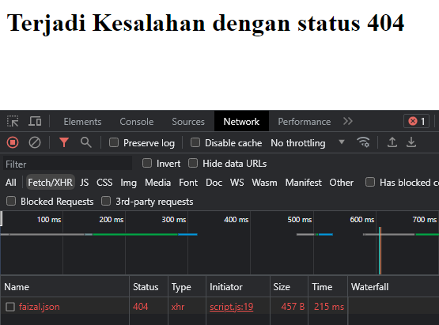

# Response Status di AJAX

---

## Response Status

- AJAX adalah proses komunikasi Client dan Server
- Dalam komunikasi Client dan Server, kita tidak bisa selalu menganggap proses tersebut akan berjalan lancar.
- Akan ada banyak hal-hal yang bisa mengganggu proses AJAX yang bisa menyebabkan error, seperti; koneksi internet bermasalah, error dari server, data dari client tidak valid, dan lain-lain.
- Server biasanya akan mengirimkan HTTP Status Code yang sesuai dengan jenis response nya, seperti yang sudah dibahas di materi HTTP
- Untuk mengetahui status response dari Server, kita bisa menggunakan property status
- https://developer.mozilla.org/en-US/docs/Web/API/XMLHttpRequest/status

---

## Response Status di AJAX

*index.html*

```html
<!DOCTYPE html>
<html lang="en">
<head>
    <meta charset="UTF-8">
    <meta name="viewport" content="width=device-width, initial-scale=1.0">
    <title>Document</title>
</head>
<body>
    <h1 id="response"></h1>
    <script src="scripts/script.js"></script>
</body>
</html>
```

**jika berhasil :**

*script.js*

```js
function displayResponse(json) {
    const header = document.getElementById("response");
    header.textContent = json.response;
}

const ajax = new XMLHttpRequest();
ajax.open("GET", "api/hello.json");
ajax.addEventListener("load", function() {
    if(ajax.status === 200) {
        const json = JSON.parse(ajax.responseText);
        displayResponse(json)
    } else {
        displayResponse({
            response: `Terjadi Kesalahan dengan status ${ajax.status}`
        });
    }
});

ajax.send(); // mengirim request
```

**Hasil :**


**Jika gagal :**

*script.js*

```js
function displayResponse(json) {
    const header = document.getElementById("response");
    header.textContent = json.response;
}

const ajax = new XMLHttpRequest();
ajax.open("GET", "api/faizal.json");
ajax.addEventListener("load", function() {
    if(ajax.status === 200) {
        const json = JSON.parse(ajax.responseText);
        displayResponse(json)
    } else {
        displayResponse({
            response: `Terjadi Kesalahan dengan status ${ajax.status}`
        });
    }
});

ajax.send(); // mengirim request
```

**Hasil :**

