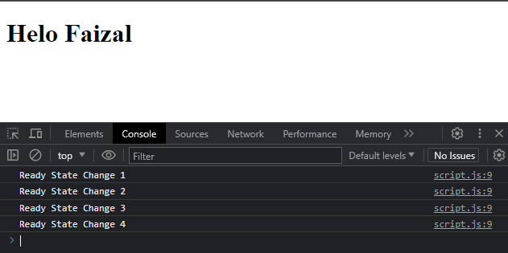

# State di AJAX

---

## State di AJAX

- AJAX memiliki tahapan state, dimana kita bisa mendapatkan banyak sekali state di Ajax menggunakan property readyState
- Property readyState mengembalikan nilai number, dimana tiap number merupakan representasi dari statenya

---

## Daftar State

<table border="1" width="100%">
    <tr>
        <th>Value</th>
        <th>State</th>
        <th>Description</th>
    </tr>
    <tr>
        <td>0   </td>
        <td>UNSENT</td>
        <td>Client has been created. open() not called yet.</td>
    </tr>
    <tr>
        <td>1</td>
        <td>OPENED</td>
        <td>open() has been called</td>
    </tr>
    <tr>
        <td>2</td>
        <td>HEADERS_RECEIVED</td>
        <td>send() has been called, and headers and status are available.</td>
    </tr>
    <tr>
        <td>3</td>
        <td>LOADING</td>
        <td>Downloading; responText holds partial data.</td>
    </tr>
    <tr>
        <td>4</td>
        <td>DONE</td>
        <td>The operation is complete</td>
    </tr>
</table>
---

## Ready State Change Event

- Jika kita ingin mendengarkan perubahan yang terjadi pada state, kita bisa menggunakan event readystatechange
- https://developer.mozilla.org/en-US/docs/Web/API/XMLHttpRequest/onreadystatechange

---

## Kode : Ready State Change Event

*script.js*

```js
function displayResponse(json) {
    const header = document.getElementById("response");
    header.textContent = json.response;
}

const ajax = new XMLHttpRequest();
// ajax.addEventListener("readystatechange", callback)
ajax.onreadystatechange = function() {
    console.log(`Ready State Change ${ajax.readyState}`);
}
ajax.open("GET", "api/hello.json");
ajax.addEventListener("load", function() {
    if(ajax.status === 200) {
        const json = JSON.parse(ajax.responseText);
        displayResponse(json)
    } else {
        displayResponse({
            response: `Terjadi Kesalahan dengan status ${ajax.status}`
        });
    }
});

ajax.send(); // mengirim request
```

**Hasil :**

