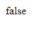

# Operator Logika

-   Operator logika = operator untuk 2 buah data boolean
-   Hasil dari operator logika adalah boolean lagi

---

## Tabel

<table border="1" width="100%">
    <tr>
        <th>Operator</th>
        <th>Keterangan</th>
    </tr>
    <tr>
        <td>&&</td>
        <td>Dan</td>
    </tr>
    <tr>
        <td>||</td>
        <td>Atau</td>
    </tr>
    <tr>
        <td>!</td>
        <td>Kebalikan</td>
    </tr>
</table>

---

## Operator &&

<table border="1" width="100%">
    <tr>
        <th>Nilai 1</th>
        <th>Operator</th>
        <th>Nilai 2</th>
        <th>Hasil</th>
    </tr>
    <tr>
        <td>true</td>
        <td>&&</td>
        <td>true</td>
        <td>true</td>
    </tr>
    <tr>
        <td>true</td>
        <td>&&</td>
        <td>false</td>
        <td>false</td>
    </tr>
    <tr>
        <td>false</td>
        <td>&&</td>
        <td>true</td>
        <td>false</td>
    </tr>
    <tr>
        <td>false</td>
        <td>&&</td>
        <td>false</td>
        <td>false</td>
    </tr>
</table>

---

## Operator ||

<table border="1" width="100%">
    <tr>
        <th>Nilai 1</th>
        <th>Operator</th>
        <th>Nilai 2</th>
        <th>Hasil</th>
    </tr>
    <tr>
        <td>true</td>
        <td>||</td>
        <td>true</td>
        <td>true</td>
    </tr>
    <tr>
        <td>true</td>
        <td>||</td>
        <td>false</td>
        <td>true</td>
    </tr>
    <tr>
        <td>false</td>
        <td>||</td>
        <td>true</td>
        <td>true</td>
    </tr>
    <tr>
        <td>false</td>
        <td>||</td>
        <td>false</td>
        <td>false</td>
    </tr>
</table>

---

## Operator Unary !

<table border="1" width="100%">
    <tr>
        <th>Operator</th>
        <th>Nilai 2</th>
        <th>Hasil</th>
    </tr>
    <tr>
        <td>!</td>
        <td>true</td>
        <td>false</td>
    </tr>
    <tr>
        <td>!</td>
        <td>false</td>
        <td>true</td>
    </tr>
</table>

---

## Contoh

```js
const nilaiUjian = 70;
const nilaiAbsensi = 70;

const lulusUjian = nilaiUjian > 75;
const lulusAbsensi = nilaiAbsensi > 75;

const lulus = lulusUjian && lulusAbsensi;
document.writeln(lulus);
```

**Hasil :**


