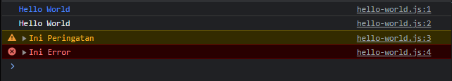

# Console

-   Javascript memiliki fitur untuk melakukan logging bernama **console**
-   **Logging** = mekanisme yang biasa dilakukan oleh programmer untuk **menampilkan** informasi dari aplikasi yang sedang berjalan, **tanpa** harus menganggu alur kerja aplikasi dan juga interaksi user
-   Untuk melakukan ini, kita bisa menggunakan **fitur console** di javascript
-   Untuk menggunakan console, kita cukup gunakan **perintah console** di kode javascript

---

## Console Method

<table border="1" width="100%">
    <tr>
        <th>Console Method</th>
        <th>Keterangan</th>
    </tr>
    <tr>
        <td>console.info(...) / console.log(...)</td>
        <td>Memberitahu informasi</td>
    </tr>
    <tr>
        <td>console.warn(...)</td>
        <td>Memberitahu informasi peringatan</td>
    </tr>
    <tr>
        <td>console.error(...)</td>
        <td>Memberitahu informasi error</td>
    </tr>
    <tr>
        <td>console.table(...)</td>
        <td>Memberitahu informasi dalam bentuk tabel</td>
    </tr>
</table>

---

## Console Info

```js
console.debug("Debug"); // default tidak dikeluarkan, kita atur levelnya
console.info("Hello World");
console.warn("Ini Peringatan");
console.error("Ini Error");
```

**Hasil :**


