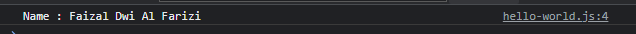
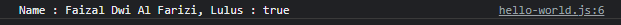
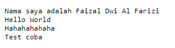

# String Template

-   Kita sudah tahu bahwa untuk menambahkan string dengan data lain, kita bisa menggunakan **operator + (plus)**
-   Namun pada kasus tertentu, penggunaan operator + (plus) sangat **menyulitkan**, apalagi jika dalam **jumlah banyak**
-   Javascript memiliki fitur yang bernama **String Template**, dimana kita bisa **mensubtitusi** data dari luar string, seperti mengambil data varaible, atau bahkan melakukan operasi matematika
-   Untuk menggunakan String Template, cara pembuatan string nya harus menggunakan **` (backtick)** bukan ' (petik 1) / " (petik 2)

### Kode

_script.js_

```js
const template = `Name : `;
```

---

## Mengambil Variable

_script.js_

```js
const name = "Faizal Dwi Al Farizi";
const template = `Name : ${name}`;

console.info(template);
```

**Hasil :**



---

```js
const name = "Faizal Dwi Al Farizi";
const firstName = "Faizal";
const middleName = "Dwi";
const lastName = "Al Farizi";
const template = `Name : ${firstName} ${middleName} ${lastName}`;

console.info(template);
```

---

## Expression di String Template

```js
const name = "Faizal Dwi Al Farizi";
const value = 80;

const template = `Name : ${name}, Lulus : ${value > 75}`;

console.info(template);
```

**Hasil :**



---

## Multiline String

-   String template juga bisa digunakan untuk membuat **string multi line**
-   Kita cukup tambahkan **enter** di text nya

### Kode

```js
let multiLineString = `
Nama saya adalah Faizal Dwi Al Farizi
Hello World
Hahahahahaha
Test coba
`;

document.writeln("<pre>");
document.writeln(multiLineString);
document.writeln("</pre>");
```

**Hasil :**


