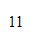
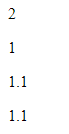
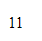
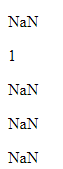
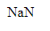
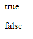

# Konversi String Dan Number

-   Saat kita membuat apk, kadang kita **input** dari pengguna selalu dalam bentuk **string**
-   Sedangkan kita ingin mengelola datanya dalam bentuk **Number**
-   Maka sangat disarankan untuk melakukan **konversi tipe data**

### Kode

```js
const value1 = "1";
const value2 = 1;
const sum = value1 + value2;

document.writeln(`<p>${sum}</p>`);
```

**Hasil :**



Inginnya : 1
hasilnya 11
karena : string + string : 11

---

## Melakukan Konversi String Dan Number

<table border="1" width="100%">
    <tr>
        <th>Function</th>
        <th>Keterangan</th>
    </tr>
    <tr>
        <td>parseInt(string)</td>
        <td>Mengkonversi dari string ke number (bilangan bulat)</td>
    </tr>
    <tr>
        <td>parseFloat(string)</td>
        <td>Mengkonversi dari string ke number (bilangan pecahan)</td>
    </tr>
    <tr>
        <td>Number(string)</td>
        <td>Mengkonversi dari string ke number (bilangan bulat / pecahan)</td>
    </tr>
    <tr>
        <td>number.toString()</td>
        <td>Mengkonversi dari number ke string</td>
    </tr>
</table>

### Kode

```js
const value1 = parseInt("1");
const value2 = 1;
const sum = value1 + value2;

document.writeln(`<p>${sum}</p>`);

document.writeln(`<p>${parseInt("1.1")}</p>`);
document.writeln(`<p>${parseFloat("1.1")}</p>`);
document.writeln(`<p>${Number("1.1")}</p>`);
```

**Hasil :**



---

```js
const a = 1;
const b = 1;
const total = a.toString() + b.toString();
document.writeln(`<p>${total}</p>`);
```

**Hasil :**



---

## NaN

-   Bagaimana jika terjadi data string yang kita coba konversi ke number **bukanlah** data yang valid?
-   Jika data string yang kita coba lakukan konversi bukanlah data valid, maka hasil dari koversi tersebut adalah **NaN(Not a Number)**
-   Nan adalah number spesial yang menyebutkan bahwa ini **bukanlah number**
-   Jika NaN dioperasikan dengan data number lainnya, maka hasilnya akan menjadi **NaN lagi**

### Kode

```js
document.writeln(`<p>${parseInt("salah")}</p>`); // NaN
document.writeln(`<p>${parseInt("1.1text")}</p>`); // 1.1

// Number() tidak akan mentoleriri kesalahan pada data
document.writeln(`<p>${Number("1.1ups")}</p>`); // NaN
document.writeln(`<p>${Number("1.1x")}</p>`); // NaN
document.writeln(`<p>${Number("bukan number")}</p>`); // NaN
```

**Hasil :**



---

## Operasi pada NaN

```js
const value1 = Number("salah"); // NaN
const value2 = 100;
const sum = value1 + value2; //NaN

document.writeln(`<p>${sum}</p>`);
```

**Hasil :**



---

## isNaN() Function

-   Kadang kita ingin **mengecek** apakah sebuah number itu NaN / bukan
-   Untuk melakukan pengecekan tersebut, kita bisa menggunakan function **isNaN(number)**
-   Hasil nya adalah berupa data boolean, **true** jika NaN, **false** jika bukan

### Kode

```js
const value1 = Number("salah"); // NaN
const value2 = 100;
const sum = value1 + value2; //NaN

document.writeln(`<p>${isNaN(sum)}</p>`);
document.writeln(`<p>${isNaN(100)}</p>`);
```

**Hasil :**


