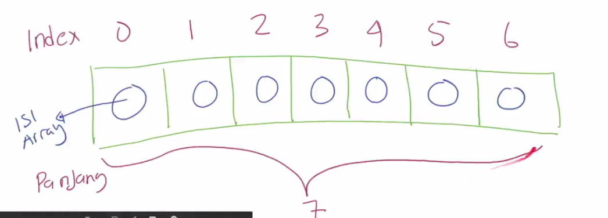
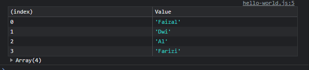
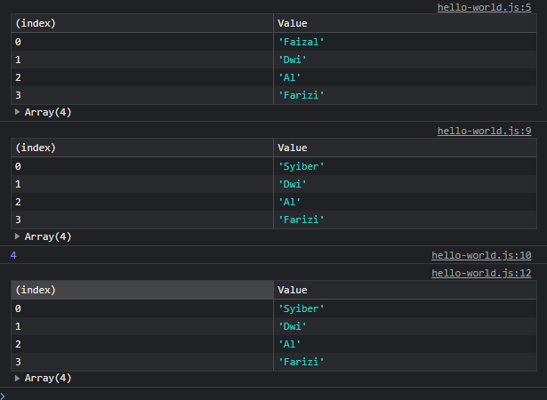
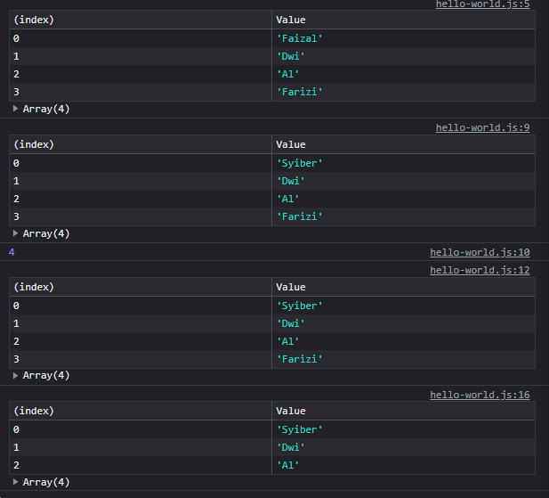
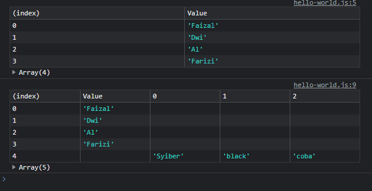

# Tipe Data Array

-   **Array** = tipe data yang berisikan kumpulan data
-   Array di javascript memiliki sifat **dinamis**, artinya datanya bisa **bertambah** dengan sendirinya saat kita memasukkan data ke dalam array

---

## Kode Membuat Array

```js
let arrayKosong = [];

let arrayNama = ["faizal", "dwi", "alfarizi", 1, true];
```

---

## Cara Kerja Array

-   Setiap data di array akan disimpan dalam posisi berurutan, dimana urutan pertama dimulai dari **nomor 0**
-   Setiap kita menambahkan data ke array, otomatis data akan disimpan diurutan **terakhir**
-   Urutan di array, kita sebut dengan **index**



---

## Menambahkan Array

```js
const names = [];
names.push("Faizal");
names.push("Dwi", "Al", "Farizi");

console.table(names);
```

**Hasil :**



---

## Operasi di Array

<table border="1" width="100%">
    <tr>
        <th>Operasi</th>
        <th>Keterangan</th>
    </tr>
    <tr>
        <td>array.push(value)</td>
        <td>Menambahkan data ke array</td>
    </tr>
    <tr>
        <td>array.length</td>
        <td>Untuk mendapatkan panjang Array</td>
    </tr>
    <tr>
        <td>array[index]</td>
        <td>Mendapatkan data di posisi index</td>
    </tr>
    <tr>
        <td>array[index] = value</td>
        <td>Mengubah data di posisi index</td>
    </tr>
    <tr>
        <td>delete array[index]</td>
        <td>Menghapus data di posisi index, namum index tidak bergeser</td>
    </tr>
    
</table>

---

## Kode Operasi di Array

```js
const names = [];
names.push("Faizal");
names.push("Dwi", "Al", "Farizi");

console.table(names);

names[0] = "Syiber";

console.table(names);
console.info(names.length);

console.table(names);
```



---

## Mengahapus Array

```js
const names = [];
names.push("Faizal");
names.push("Dwi", "Al", "Farizi");

console.table(names);

names[0] = "Syiber";

console.table(names);
console.info(names.length);

console.table(names);

delete names[3];

console.table(names);
```



---

## Perlu Diingat

-   Data di dalam Array **tidak ada batasannya** harus data apa
-   Jadi kita **bisa** memasukkan data **apapun** ke dalam Array
-   Bahkan kita juga bisa memasukkan **Array ke dalam Array** jika kita mau

```js
const names = [];
names.push("Faizal");
names.push("Dwi", "Al", "Farizi");

console.table(names);

names.push(["Syiber", "black", "coba"]);

console.table(names);
```


