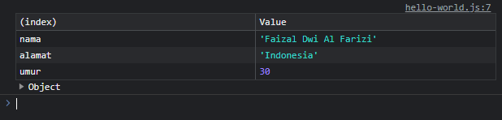

# Tipe Data Object

---

## Associative Array

-   Di bahasa pemrograman lain seperti PHP, kita bisa menggunakan index beruba tipe data lain selain number, misal **string**
-   Fitur ini biasanya disebut **associative array atau hash**
-   Di JavaScript associative array **tidak didukung**.
-   Jika kita **memaksa** memasukkan data bukan number di index Array, maka JavaScript akan merubah tipe data Array tersebut menjadi **object**, dan ini bisa berbahaya, karena beberapa operasi di array mungkin bisa berubah hasilnya

---

## Tipe Data Object

-   **Tipe data object** adalah tipe data yang mirip dengan tipe data Array
-   Yang membedakan adalah **index** pada tipe data object bisa menggunakan **string**
-   Index di object biasanya disebut **attributes atau properties**, bukan index

---

## Kode Membuat Object Kosong

```js
const orang = {};
```

---

## Kode Mengubah dan Menghapus Property di Object

```js
const orang = {};

// Menambah atau Mengubah
orang["nama"] = "Faizal Dwi Al Farizi";
orang["alamat"] = "Indonesia";
orang["umur"] = 30;

console.table(orang);

// Menghapus
delete orang["umur"];

console.table(orang);
```


---

## Kode Membuat Object dengan Properties

```js
const orang = {
    nama: "Faizal Dwi Al Farizi",
    alamat: "Indonesia",
    umur: 30,
};

console.table(orang);
```



---

## Kode Mengakses Property Object

```js
const orang = {
    nama: "Faizal Dwi Al Farizi",
    alamat: "Indonesia",
    umur: 30,
};

console.info(`Nama : ${orang["nama"]}`);
console.info(`Alamat : ${orang.alamat}`);
console.info(`Umur : ${orang.umur}`);
```


