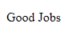
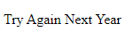
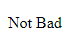

# If Expression

---

## If Expression

-   Dalam JavaScript, **if** adalah salah satu kata kunci yang digunakan untuk **percabangan**
-   **Percabangan** artinya kita bisa mengeksekusi kode program tertentu ketika **suatu kondisi terpenuhi**
-   Hampir di semua bahasa pemrograman mendukung **if expression**

---

## Kode If Expression

```js
const examValue = 90;

if (examValue > 80) {
    document.writeln("<p>Good Jobs</p>");
}
```



---

## Else Expression

-   Blok if akan dieksekusi ketika kondisi if bernilai **true**
-   Kadang kita ingin melakukan **eksekusi program** tertentu jika kondisi if bernilai **false**
-   Hal ini bisa dilakukan menggunakan **else expression**

---

## Kode Else Expression

```js
const examValue = 70;

if (examValue > 80) {
    document.writeln("<p>Good Jobs</p>");
} else {
    document.writeln("<p>Try Again Next Year</p>");
}
```



---

## Else If Expression

-   Kadang dalam If, kita butuh membuat **beberapa kondisi**
-   Kasus seperti ini, di JavaScript kita bisa menggunakan **Else If expression**

---

## Kode Else If Expression

```js
const examValue = 70;

if (examValue > 80) {
    document.writeln("<p>Good Jobs</p>");
} else if (examValue > 60) {
    document.writeln("<p>Not Bad</p>");
} else {
    document.writeln("<p>Try Again Next Year</p>");
}
```


