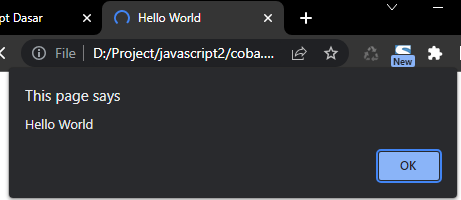
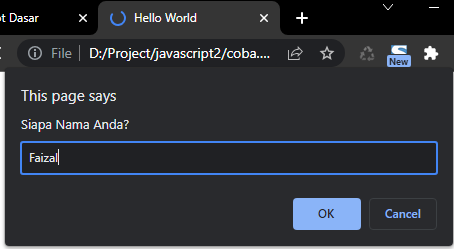
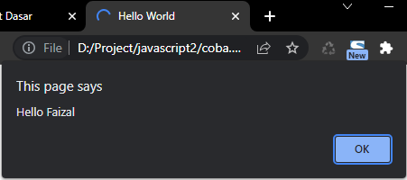
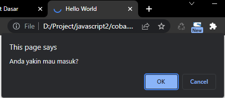

# Popup

---

## Alert, Prompt dan Confirm

-   JavaScript memiliki fitur yang bernama **alert, prompt dan confirm**
-   **Alert** digunakan untuk memberi peringatan berupa popup text di browser
-   **Prompt** digunakan untuk meminta input string dari pengguna browser dalam bentuk popup input text
-   Sedangkan **confirm** digunakan untuk meminta input boolean dari pengguna browser dalam bentuk popup input pilihan

---

## Kode : Alert

```js
alert("Hello World");
```

**Hasil :**



---

## Kode : Prompt

```js
const name = prompt("Siapa Nama Anda?");

alert(`Hello ${name}`);
```

**Hasil :**





---

## Kode : Confirm

```js
const masuk = confirm("Anda yakin mau masuk?");

if (masuk) {
    const name = prompt("Siapa Nama Anda?");
    alert(`Hello ${name}`);
} else {
    alert("Bye bye");
}
```


