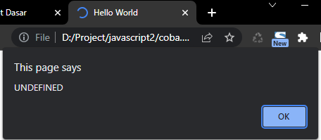
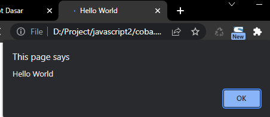
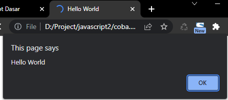

# Undefined

---

## undefined

-   undefined adalah sebuah **kata kunci** di JavaScript
-   undefined adalah sebuah **tipe data**
-   Sebuah variable yang **belum** ditambahkan nilai, maka artinya variable tersebut merupakan tipe undefined
-   Kadang untuk programmer JavaScript pemula undefined ini memang agak **sedikit membingungkan**
-   undefined itu berbeda dengan null di bahasa pemrograman lain

---

## Kode : Undefined Variable

```js
let name;
if (name === undefined) {
    alert("UNDEFINED");
} else {
    alert("DEFINED");
}
```

**Hasil :**



---

## Kode : Undefined Array Value

```js
const names = ["Faizal", "Dwi"];

if (names[2] === undefined) {
    alert("Hello World");
} else {
    alert(`Hello ${names[2]}`);
}
```



---

## Kode : Undefined Object Property

```js
let person = {};

if (person.name === undefined) {
    alert("Hello World");
} else {
    alert(`Hello ${person.name}`);
}
```

**Hasil :**


