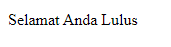
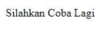

# Ternary Operator

---

## Ternary Operator

-   **Ternary operator** adalah operator sederhana dari if statement
-   Ternary operator terdiri dari kondisi yang **dievaluasi**, jika menghasilkan true maka nilai pertama diambil, jika false, maka nilai kedua diambil

---

## Kode : Tanpa Ternary Operator

```js
const nilai = 75;
let ucapan;

if (nilai >= 75) {
    ucapan = "Selamat Anda Lulus";
} else {
    ucapan = "Silahkan Coba Lagi";
}

document.writeln(`<p>${ucapan}</p>`);
```

**Hasil :**



---

## Kode : Dengan Ternary Operator

```js
const nilai = 60;
const ucapan = nilai >= 75 ? "Selamat Anda Lulus" : "Silahkan Coba Lagi";

document.writeln(`<p>${ucapan}</p>`);
```

**Hasil :**


