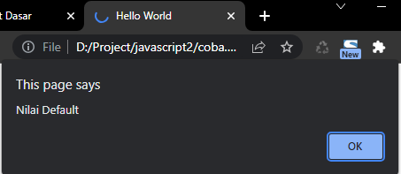

# Nullish Coalescing Operator

---

## Nullish Coalescing Operator

-   **Nullist value** adalah null dan undefined
-   **Nullist coalescing operator (??)** adalah operator mirip dengan ternary operator, yang membedakan adalah pada kondisi, jika bernilai null atau undefined, baru value default nya diambil

---

## Kode : Tanpa Nullish Coalescing Operator

```js
let parameter;

let data = parameter;
if (data === undefined || data === null) {
    data = "Nilai Default";
}

alert(data);
```

**Hasil :**



---

## 

```js
let parameter;

let data = parameter ?? "Nilai Default";

alert(data);
```