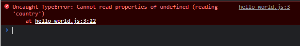
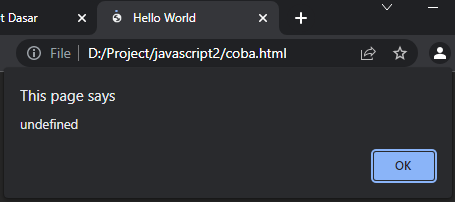

# Optional Chaining

---

## Optional Chaining

-  **Optional chaining operator (?)** merupakan operator yang digunakan untuk **mengamankan** ketika kita ingin mengakses property sebuah object **dari data nullish**
-  Jika kita mencoba mengakses property dari sebuah object dari data nullish tanpa menggunakan optional chaining operator, maka akan terjadi error

---

## Kode : Error Mengakses Property Nullish

```js
let person = {}

alert(person.address.country);
```

**Hasil :**



---

## Kode : Pengecekan Menggunakan If

```js
let person = {}

let say;
if(person.address !== undefined && person.address !== null) {
    say = person.address.country
}

alert(say);
```

**Hasil :**



> jadi tidak akan error karena kodenya dicek terlebih dahulu

---

## Kode : Menggunakan Optional Chaining

```js
let person = {}

alert(person?.address?.country);
```

**Hasil :**

