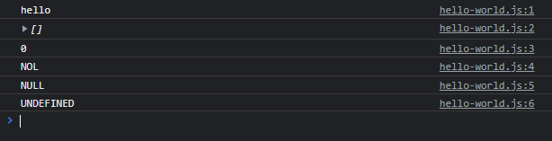
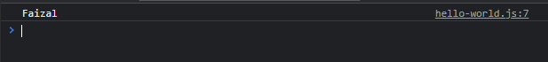
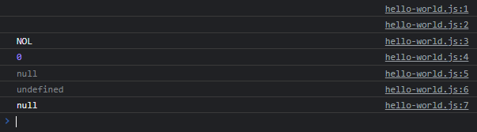

# Operator Logika di Non Boolean

---

## Operator Logika di Non Boolean

- Sebelumnya kita sudah tahu bahwa operator logika **AND (&&) dan OR (||)** digunakan untuk **dua data boolean**
- Namun berbeda di JavaScript, kita bisa menggunakan operator logika AND dan OR untuk **tipe data non boolean**

---

## Operator OR (||) di Non Boolean

- **Operator logika OR (||)**, membaca dari **kiri ke kanan**.
- Operator ini akan mengambil **nilai pertama** yang **truthy**.
- Jika **tidak ada** satupun yang bernilai truthy, maka yang **terakhir** yang akan diambil

---

## Kode : Operator OR (||)

> jadi yang akan kita ambil itu yang truthy

```js
console.info("hello" || ''); // hello
console.info("" || []); // []
console.info("0" || "NOL"); // "0"
console.info(0 || "NOL"); // NOL
console.info(null || "NULL"); // "NULL"
console.info(undefined || "UNDEFINED"); // "UNDEFINED"
```

**Hasil :**



---

```js
const person = {
    fistName: "Faizal",
    lastName: "Al Farizi"
}

const name = person.fistName || person.lastName;
console.info(name);
```



---

## Operator AND (&&) di Non Boolean

- **Operator logika AND (||)**, membaca dari kiri ke kanan.
- Operator ini akan mengambil nilai pertama yang **falsy**.
- Jika **tidak ada** satupun yang bernilai falsy, maka yang **terakhir** yang akan diambil

---

## Kode : Operator AND (&&)

```js
console.info("hello" && ''); // ''
console.info("" && []); // ""
console.info("0" && "NOL"); // "NOL"
console.info(0 && "NOL"); // null
console.info(null && "NULL"); // undefined
console.info(undefined && "UNDEFINED"); // "UNDEFINED"
console.info("undefined" && "null"); // "null"
```

**Hasil :**



