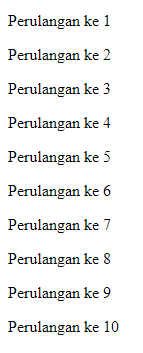

# For Loop

---

## For Loop

- **For** adalah salah satu kata kunci yang bisa digunakan untuk melakukan **perulangan**
- Blok kode yang terdapat di **dalam** for akan selalu diulangi selama kondisi for **terpenuhi**

---

## Sintak Perulangan For

```js
for(init statement; kondisi; post statement){
 // block perulangan
}
```

- **Init statement** akan dieksekusi hanya sekali di awal sebelum perulangan
- Kondisi akan dilakukan pengecekan dalam setiap perulangan, jika **true** perulangan akan dilakukan, jika **false** perulangan akan berhenti
- **Post statement** akan dieksekusi setiap kali diakhir perulangan
- Init statement, Kondisi dan Post Statement **tidak wajib** diisi, jika Kondisi tidak diisi, berarti kondisi selalu bernilai **true**

---

## Kode : Perulangan Tanpa Henti

```js
for ( ; ; ) {
    alert("For Loop");
}
```

---

## Kode : Perulangan Dengan Kondisi 

```js
let counter = 1;
for( ; counter <= 10; ) {
    document.writeln(`<p>Perulangan ke ${counter}</p>`);
    counter++;
}
```

**Hasil :**



---

## Kode : Perulangan Dengan Init Statement

```js
for(let counter = 1; counter <= 10; ) {
    document.writeln(`<p>Perulangan ke ${counter}</p>`);
    counter++;
}
```

---

## Kode : Perulangan Dengan Post Statement

```js
for(let counter = 1; counter <= 10; counter++) {
    document.writeln(`<p>Perulangan ke ${counter}</p>`);
}
```