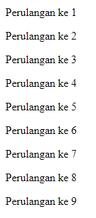

# While Loop

---

## While Loop

- **While loop** adalah versi perulangan yang **lebih sederhana** dibanding for loop
- Di while loop, **hanya** terdapat kondisi perulangan, **tanpa** ada init statement dan post statement

---

## Kode : While Loop

```js
let counter = 1;
while(counter < 10) {
    document.writeln(`<p>Perulangan ke ${counter}</p>`);
    counter++;
}
```

**Hasil :**



