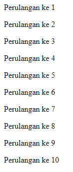

# Do While Loop

---

## Do While Loop

- **Do While loop** adalah perulangan yang mirip dengan while
- **Perbedaannya** hanya pada pengecekan kondisi
- Pengecekan kondisi di **while loop** dilakukan di **awal** sebelum perulangan dilakukan, sedangkan di **do while loop** dilakukan **setelah** perulangan dilakukan
- Oleh karena itu dalam do while loop, **minimal** pasti sekali perulangan dilakukan walaupun kondisi **tidak bernilai true**

---

## Kode : Do While Loop 

```js
let counter = 1;

do {
    document.writeln(`<p>Perulangan ke ${counter}</p>`);
    counter++;
}
while(counter <= 10);
```

**Hasil :**

