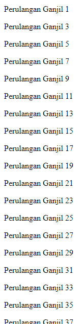

# Break dan Continue

---

## Break & Continue

- Pada **switch statement**, kita sudah mengenal kata kunci break, yaitu untuk **menghentikan** case dalam switch
- Sama dengan pada perulangan, break juga **digunakan** untuk menghentikan seluruh perulangan.
- Namun berbeda dengan **continue**, continue digunakan untuk **menghentikan perulangan saat ini**, lalu **melanjutkan ke perulangan selanjutnya**

---

## Kode : Break

```js
let counter = 1;
while (true) {
    document.writeln(`<p>Perulangan ke ${counter}</p>`);
    counter++

    if(counter  > 10) {
        break;
    }
}
```

---

## Kode : Continue

```js
let counter = 1;
for(let i = 1; i <= 100; i++) {
    if(i % 2  == 0) {
        continue;
    }
    document.writeln(`<p>Perulangan Ganjil ${i}</p>`);
}
```

