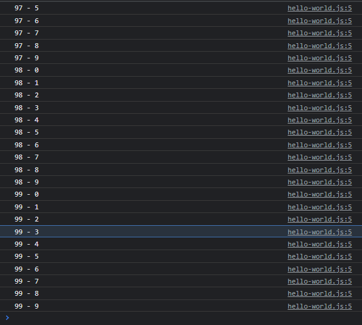
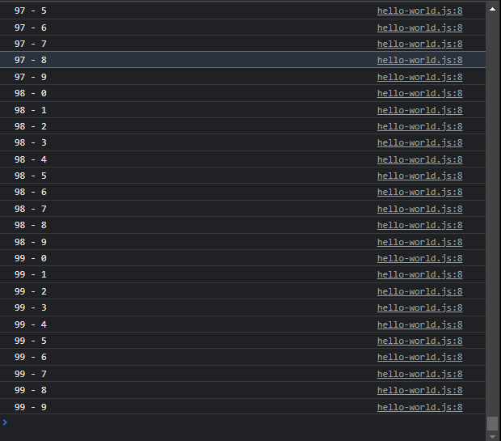

# Label

---

## Label

- **Label** merupakan penanda yang bisa digunakan dengan kata kunci break dan continue
- Secara default saat kita melakukan **break atau continue**, dia akan melakukan terhadap perulangan dimana kode break dan continue itu digunakan
- Dengan menggunakan label, kita bisa melakukan break dan continue terhadap perulangan yang kita inginkan, asalkan pada perulangannya kita gunakan label
- Untuk membuat label, kita bisa gunakan nama label lalu diikuti dengan : (titik dua)

---

## Kode : Label

```js
loopi :
for (let i = 0; i < 100; i++) {
    loopj:
    for (let j = 0; j < 10; j++) {
        console.info(`${i} - ${j}`);
    }
}
```

**Hasil :**



---

## Kode : Continue atau Break di Label

```js
loopi :
for (let i = 0; i < 100; i++) {
    loopj:
    for (let j = 0; j < 10; j++) {
        if(j > 10) {
            continue loopi;
        }
        console.info(`${i} - ${j}`);
    }
}
```

**Hasil :**

