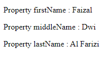
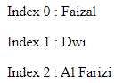

# For In

---

## For In

- **For In** merupakan perulangan for yang digunakan untuk mengiterasi seluruh data property di **object** atau **index di array**
- **Walaupun** for in bisa digunakan untuk **Array**, namun **tidak direkomendasikan** untuk Array, karena biasanya kita jarang sekali butuh data index untuk Array, kita bisa menggunakan **For Of** (yang dibahas setelah ini)

---

## Kode : For In di Object

```js
const person = {
    firstName: "Faizal",
    middleName: "Dwi",
    lastName: "Al Farizi"
}

for (const property in person) {
    document.writeln(`<p>Property ${property} : ${person[property]}</p>`)
}
```

**Hasil :**



---

## Kode : For In di Array

```js
const names = ["Faizal", "Dwi", "Al Farizi"];

for (const index in names) {
    document.writeln(`<p>Index ${index} : ${names[index]}</p>`)
}
```

**Hasil :**

